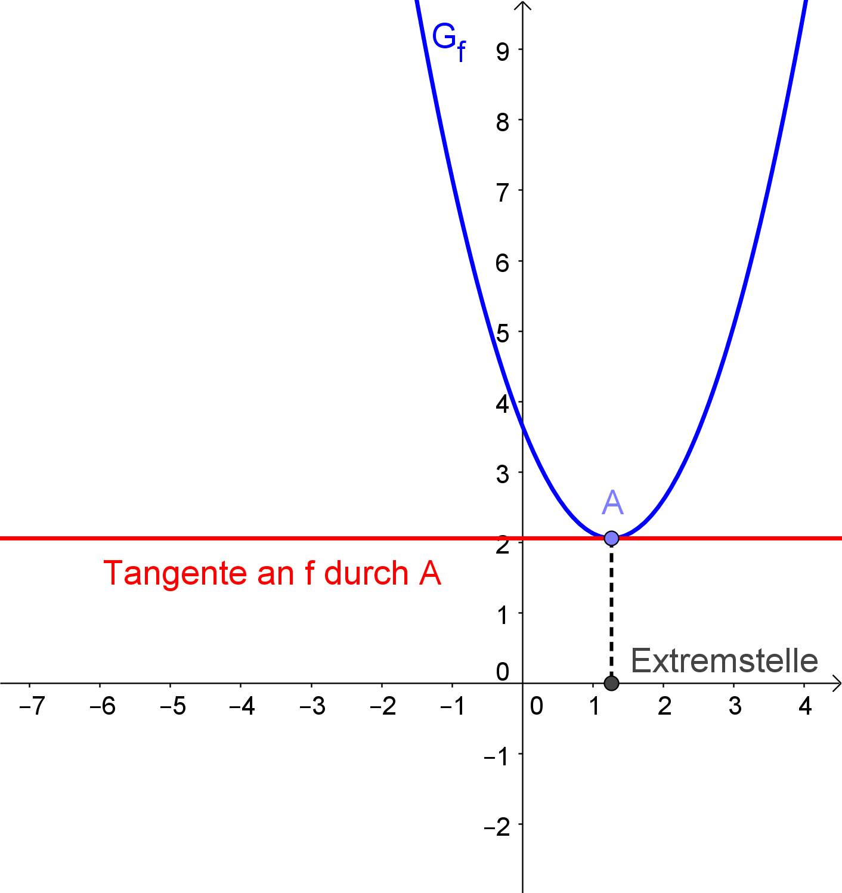
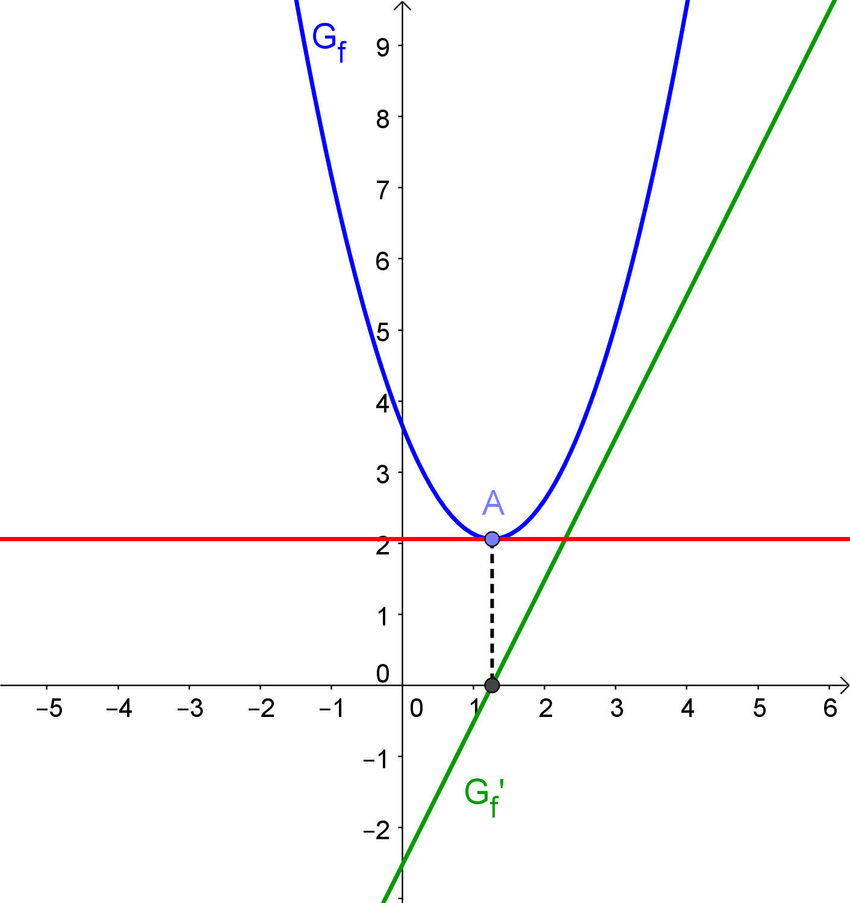
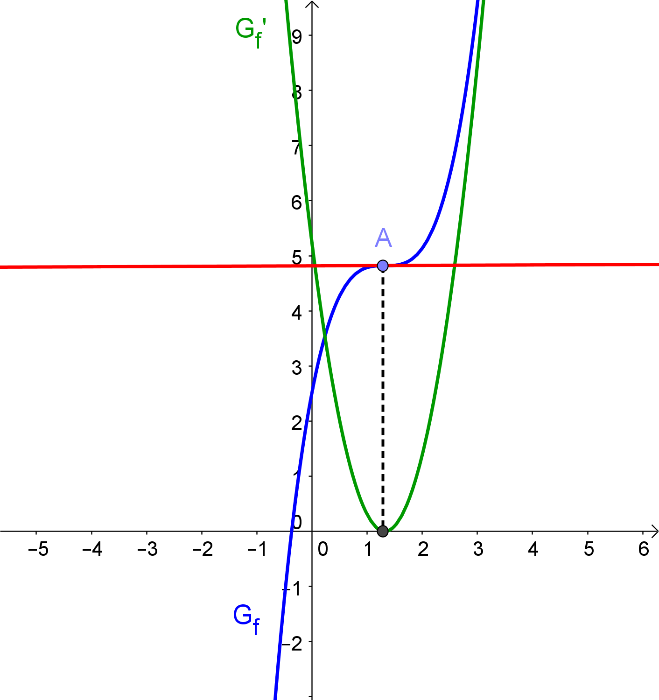

= Extremstellen
:stem:

== Motivation

Viele Aufgabenstellungen sind mit der Suche nach Hoch- und Tiefpunkten verbunden. Graphisch fällt es ziemlich leicht, die gesuchten Punkte zu finden. 

Dank der Ableitungen von Funktionen ist es auch möglich, die gesuchten Stellen zu finden, ohne den Graphen zeichnen zu müssen, verbunden mit der Tatsache, dass die gefundenen Werte exakter sind, da die Stellen nicht abgeschätzt werden, sondern berechnet werden können.

Im folgenden betrachten wir zwei Möglichkeiten, Extremstellen zu finden, wobei die untersuchten Funktionen mehrfach *differenzierbar* sein sollen (also ableitbar und damit "ohne Knick") und jede Funktion und ihre Ableitungen *stetig*, also "in einem Zug zeichenbar".

== Erste hinreichende Bedingung

Das Besondere an Hoch- und Tiefpunkten ist _zum einen_, dass dort waagrechte Tangenten vorliegen.

.Funktion f mit waagrechter Tangente am Tiefpunkt A

Somit ist die erste Ableitung der Funktion stem:[f] an dieser Stelle 0.

.Funktion f mit waagrechter Tangente und der Ableitung f'

Aber Vorsicht:

[WARNING]
====
Die Schlussfolgerung 

[stem]
++++
f'(x_0)=0 => text(Extremstelle bei )  x_0 
++++

ist *falsch*!
====

Ein einfaches Gegenbeispiel ist eine Funktion dritten Grades, die einen Sattelpunkt aufweist. In diesem Fall ist die erste Ableitung an dieser Stelle zwar 0, eine Extremstelle liegt hier aber nicht vor:

.Eine Funktion mit einem Sattelpunkt A und ihrer ersten Ableitung

Somit ist die Tatsache, dass stem:[f'(x_0)=0] sein muss zwar *notwendig*, aber *nicht hinreichend* für die Existenz einer Extremstelle von stem:[f] bei stem:[x_0].

Vergleicht man die Schaubilder der _ersten Ableitung_ für den Fall der Extremstelle und für den  Sattelpunkt, so fällt auf, dass im Fall der Extremstelle die erste Ableitung dort 0 ist und einen Vorzeichenwechsel aufweist.

Im Fall des Sattelpunktes ist die erste Ableitung dort zwar 0, wechselt aber nicht ihr Vorzeichen.

Somit können wir also auf die Existenz einer Extremstelle an einer Stelle stem:[x_0] schließen, wenn stem:[f'(x_0)=0] ist *und* _zum anderen_ der Graph von stem:[f'] bei stem:[x_0] einen Vorzeichenwechsel hat.

Somit formulieren wir die 

====
*Erste hinreichende Bedingung für Extremstellen*

Gilt für eine Funktion stem:[f], dass

stem:[f'(x_0)=0]

*und*

der Graph von stem:[f] bei stem:[x_0] einen Vorzeichenwechsel vorliegen hat,

*dann gilt:*

Bei stem:[x_0] liegt eine *Extremstelle* von stem:[f] vor.

Geht der Vorzeichenwechsel von - nach +, so handelt es sich um eine *Minimumstelle*, bei einem Wechsel von + nach - um eine *Maximumstelle*.
====

[NOTE]
====
Der zweite Teil der ersten hinreichenden Bedingung ist also nur notwendig, um die Extremstellen von den Sattelstellen zu unterscheiden.
====

