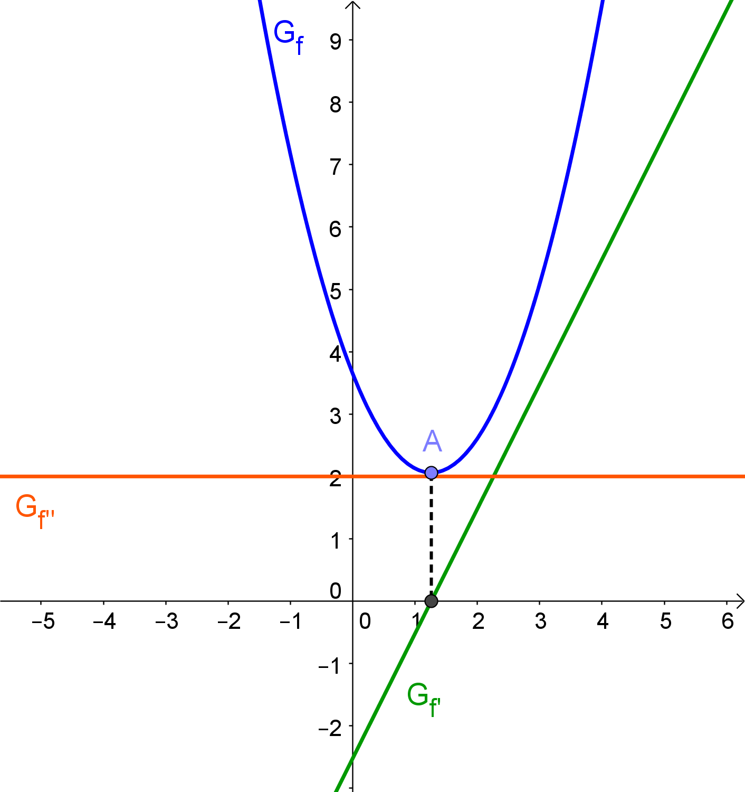
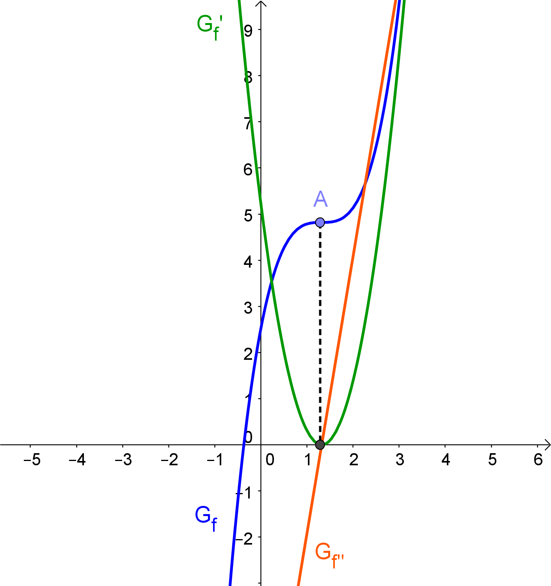

= Extremstellen
:stem:

== Motivation

Viele Aufgabenstellungen sind mit der Suche nach Hoch- und Tiefpunkten verbunden. Graphisch fällt es ziemlich leicht, die gesuchten Punkte zu finden. 

Dank der Ableitungen von Funktionen ist es auch möglich, die gesuchten Stellen zu finden, ohne den Graphen zeichnen zu müssen, verbunden mit der Tatsache, dass die gefundenen Werte exakter sind, da die Stellen nicht abgeschätzt werden, sondern berechnet werden können.

Im folgenden betrachten wir zwei Möglichkeiten, Extremstellen zu finden, wobei die untersuchten Funktionen mehrfach *differenzierbar* sein sollen (also ableitbar und damit "ohne Knick") und jede Funktion und ihre Ableitungen *stetig*, also "in einem Zug zeichenbar".

== Erste hinreichende Bedingung für lokale Extremstellen

Das Besondere an Hoch- und Tiefpunkten ist _zum einen_, dass dort waagrechte Tangenten vorliegen.

.Funktion f mit waagrechter Tangente am Tiefpunkt A
image::Bilder/Ableitungen/Waagrechte_Tangente.png[Funktion mit Tangente]

Somit ist die erste Ableitung der Funktion stem:[f] an dieser Stelle 0.

.Funktion f mit waagrechter Tangente und der Ableitung f'
image::Bilder/Ableitungen/Waagrechte_Tangente_Ableitung.png[f mit Ableitung]

Aber Vorsicht:

[WARNING]
====
Die Schlussfolgerung 

[stem]
++++
f'(x_0)=0 => text(Extremstelle bei )  x_0 
++++

ist *falsch*!
====

Ein einfaches Gegenbeispiel ist eine Funktion dritten Grades, die einen Sattelpunkt aufweist. In diesem Fall ist die erste Ableitung an dieser Stelle zwar 0, eine Extremstelle liegt hier aber nicht vor:

.Eine Funktion mit einem Sattelpunkt A und ihrer ersten Ableitung
image::Bilder/Ableitungen/Waagrechte_Tangente_Ableitung_Sattelpunkt.png[Sattelpunkt mit Ableitung]

Somit ist die Tatsache, dass stem:[f'(x_0)=0] sein muss zwar *notwendig*, aber *nicht hinreichend* für die Existenz einer Extremstelle von stem:[f] bei stem:[x_0].

Vergleicht man die Schaubilder der _ersten Ableitung_ für den Fall der Extremstelle und für den  Sattelpunkt, so fällt auf, dass im Fall der Extremstelle die erste Ableitung dort 0 ist und einen Vorzeichenwechsel aufweist.

Im Fall des Sattelpunktes ist die erste Ableitung dort zwar 0, wechselt aber nicht ihr Vorzeichen.

Somit können wir also auf die Existenz einer Extremstelle an einer Stelle stem:[x_0] schließen, wenn stem:[f'(x_0)=0] ist *und* _zum anderen_ der Graph von stem:[f'] bei stem:[x_0] einen Vorzeichenwechsel hat.

Somit formulieren wir die 

====
*Erste hinreichende Bedingung für lokale Extremstellen*

Gilt für eine Funktion stem:[f], dass

stem:[f'(x_0)=0]

*und*

der Graph von stem:[f] bei stem:[x_0] einen Vorzeichenwechsel vorliegen hat,

*dann gilt:*

Bei stem:[x_0] liegt eine *Extremstelle* von stem:[f] vor.

Geht der Vorzeichenwechsel von - nach +, so handelt es sich um eine *Minimumstelle*, bei einem Wechsel von + nach - um eine *Maximumstelle*.
====

[NOTE]
====
Der zweite Teil der ersten hinreichenden Bedingung (Vorzeichenweckel) ist also nur notwendig, um die Extremstellen von den Sattelstellen zu unterscheiden.
====

== Zweite hinreichende Bedingung für lokale Extremstellen

Durch die erste hinreichende Bedingung haben wir bereits ein Werkzeug, dass uns das Auffinden von Extremstellen vereinfacht. In diesem Abschnitt werden wir noch eine weitere Möglichkeit kennenlernen, diese rechnerisch zu bestimmen.

Dazu betrachten wir die gleichen Beispiele wie im letzten Abschnitt, nur beziehen wir in unsere Betrachtung noch die zweite Ableitung mit ein.

Zunächst untersuchen wir wieder die nach oben geöffnete Parabel:

.Eine Funktion mit einem lokalen Minimum (blau) mit erster (grün) und zweiter Ableitung (orange)

Da der Graph von stem:[f] im Bereich seines Minimums eine Linkskurve beschreibt, ist stem:[f''] in diesem Bereich positiv. Bei einem Maximum läge eine Rechtskurve vor, so dass stem:[f''] in diesem Bereich negativ wäre.

Im Falle eines Sattelpunktes ergibt sich die folgende Situation:

.Eine Funktion mit einem Sattelpunkt

Man sieht: da an dieser Stelle weder eine Links- noch eine Rechtskurve im Graphen von stem:[f] vorliegt, ist die zweite Ableitung an dieser Stelle 0.

Somit formulieren wir

====
*Die zweite hinreichende Bedingung für lokale Extremstellen*

Gilt für eine Funktion stem:[f], dass

stem:[f'(x_0)=0]

*und*

der stem:[f''(x_0)!=0] ,

*dann gilt:*

Bei stem:[x_0] liegt eine *Extremstelle* von stem:[f] vor.

Für stem:[f''(x_0)<0] (Rechtskurve) handelt es sich dabei um eine *Maximumstelle*, für stem:[f''(x_0)>0] (Linkskurve) um eine *Minimumstelle*.

====

== Unterschiede zwischen den beiden Bedingungen

In vielen Fällen scheint die zweite hinreichende Bedingung (mit der zweiten Ableitung) zunächst das einfachere Kriterium zu sein. Man beachte aber das folgende Beispiel:

[stem]
++++
f(x)=x^4
++++

Bestimmung der Extremstellen mit Hilfe der *zweiten hinreichenden Bedingung*:

[stem]
++++
f'(x)=4 x ^3
++++

[stem]
++++
f''(x)=12 x ^2
++++

Weiter gilt, dass stem:[f'(0)=0] und stem:[f''(0)=0]. Somit ist nach der zweiten hinreichenden Bedingung zunächst keine Aussage möglich. Vielmehr liegt die Vermutung nahe, dass es sich hier um eine Sattelstelle handelt.

Versucht man jedoch, die *erste hinreichende Bedingung* anzuwenden, so ergibt die Überprüfung auf einen Vorzeichenwechsel bei stem:[x_0=0]

|===
|stem:[x]|-1|0|1
|stem:[f'(x)]|-4|0|4
|===

Bei 0 liegt somit ein Vorzeichenwechsel von - nach + vor, so dass dort nach der ersten hinreichenden Bedingung eine Minimumstelle vorliegen muss.

[WARNING]
====
Sollte die zweite hinreichende Bedingung an einer Stelle stem:[x_0] keine Aussage treffen können, so muss dort noch die erste hinreichende Bedingung überprüft werden.

Hier zeigt sich nochmal: stem:[f''(x_0)=0] bedeutet *nicht*, dass bei stem:[x_0] eine Wendestelle vorliegt!
====

