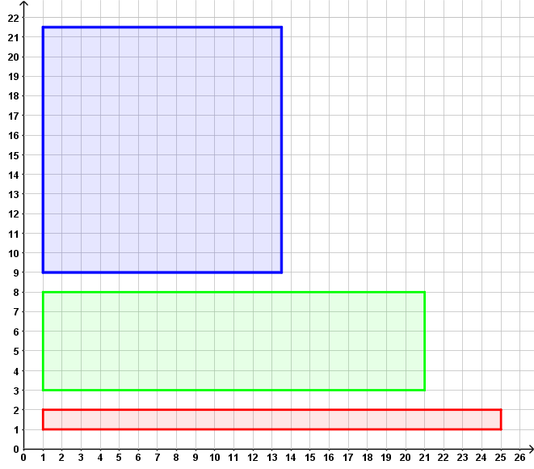
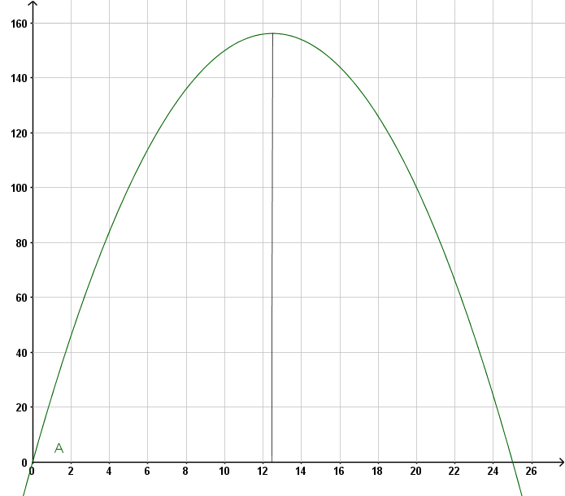
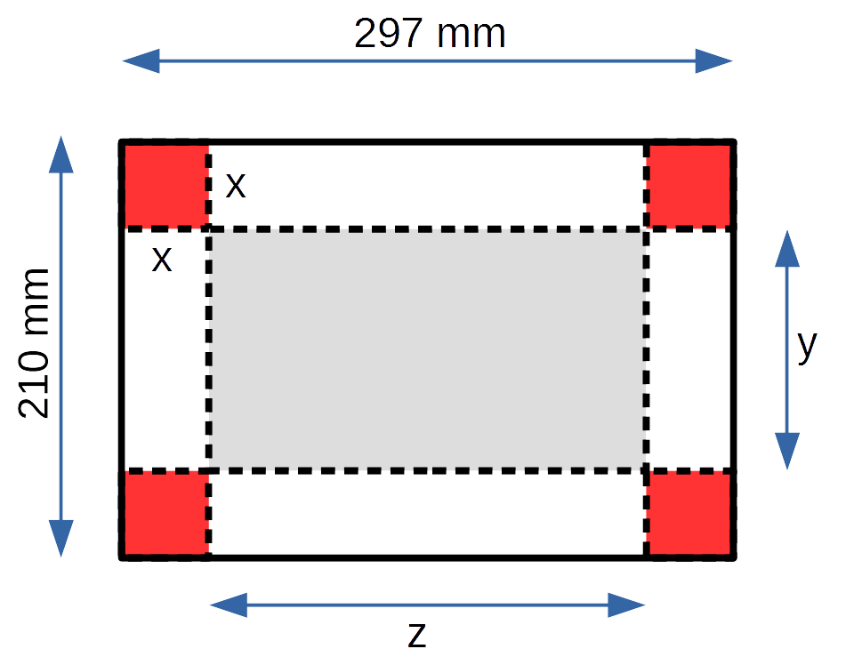
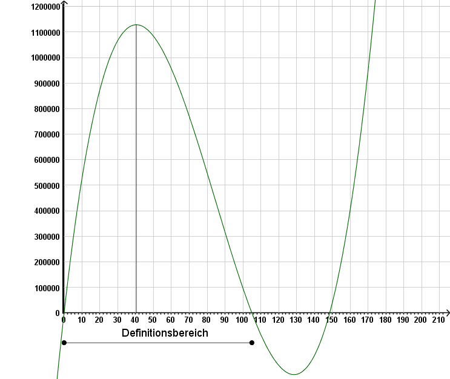

= [[Extremwertprobleme]]Extremwertprobleme mit Nebenbedingungen
:stem: 
:toc: left
:toc-title: Inhaltsverzeichnis
:sectnums:
:icons: font
:keywords: Extremwertprobleme, Nebenbedingungen, Extremwert

Bei einem Extremwertproblem mit Nebenbedingungen sind eine Größe G und einschränkende
Bedingungen für die Objekte gegeben, auf die sich die Größe bezieht. Diese Bedingungen
nennt man *Nebenbedingungen*.

Aufgabe ist es, unter den Objekten, die durch die Nebenbedingungen eingeschränkt werden,
das Objekt zu finden, bei dem die Größe G den größten oder kleinsten Wert annimmt.

====

Bsp. 1: *Bestimmen Sie das Rechteck mit dem größten Flächeninhalt, dessen Umfang 50 LE beträgt.*

Die Größe ist hier der Flächeninhalt eines Rechtecks. Die Objekte, auf die sie
sich bezieht, sind alle Rechtecke. Die *Nebenbedingung* "dessen Umfang 50 LE beträgt"
schränkt die Rechtecke ein, unter denen dasjenige gefunden werden soll, das den größten
Flächeninhalt hat. Der Leser möge nun Abb. 1 betrachten und die Lösung der Aufgabe erahnen.

[Rechtecke]
.Rechtecke mit einem Umfang von 50LE

====
Die Größe G kann durch eine Formel beschrieben werden.
Diese stellt Beziehungen zu Größen her, die sich auf die gleichen Objekte,
wie die Größe G, beziehen.
Die Nebenbedingungen liefern wiederum Formeln,
die Beziehungen zwischen diesen Größen herstellen.

====
Bsp. 1 (Fortsetzung 1)

Die Größe "Flächeninhalt eines Rechtecks" A kann durch die Formel

A = x &sdot; y für 0 &le; x und 0 &le; y

beschrieben werden. Hier bezeichnet x die Größe "Länge der
ersten Seite des Rechtecks" und y die Größe "Länge der zweiten Seite des Rechtecks".

Die Nebenbedingung "dessen Flächeninhalt 50 LE beträgt" liefert die Formel:

50 = 2x + 2y
====

Die Nebenbedingungen bewirken nicht nur eine Einschränkung der Objekte, auf
die sich die Größe G bezieht, sondern auch, dass jedes dieser Objekte durch
die Angabe einer der Größen eindeutig festgelegt ist, die in der Formel zur
Berechnung von G vorkommen.
Deshalb findet man auch eine Formel, die die Größe G nur in
Abhängigkeit dieser einzigen Größe beschreibt. Diese Formel nennt man
*Zielfunktion*. Wie man die Zielfunktion rechnerisch erhält, lässt sich
in Worten nur umständlich beschreiben und sollte am Beispiel klar werden.

==============================================================
Bsp. 1 (Fortsetzung 2)

Wählt man einen Wert für die Seitenlänge x, eines Rechtecks,
das einen Umfang von 50 LE hat, so kann man die zweite Seitenlänge y
mit Hilfe der Formel y = 25 - x, die sich aus der Formel 50 = 2x + 2y
durch Umformen ergibt, berechnen.

Die Zielfunktion erhält man durch Einsetzen von y = 25 - x in
die Formel A = x &sdot; y. Da die Formel nur für 0 &le; y definiert ist,
muss x &le; 25 gelten. Hier ist die *Zielfunktion* also gegeben durch
(s. auch Abb. 2).

A(x) = x &sdot; (25-x) für  0 &le; x &le; 25

[Rechtecke2]
.Graph der Funktion A(x)= x &sdot; (25-x)

==============================================================

Findet man nun den Wert für die Variable, bei dem die Zielfunktion
den größten oder kleinsten Wert annimmt, so hat man auch das Objekt
gefunden, unter dem die Größe G den größten oder kleinsten Wert
annimmt. Die Variable der Zielfunktion bezeichnet ja eine Größe, die
die betrachteten Objekte eindeutig beschreibt.
Um den Wert zu finden, bei dem die Zielfunktion den größten oder
kleinsten Wert annimmt, setzt man die Kriterien zur Auffindung von
Extremstellen ein. Allerdings ist zu beachten, dass nicht ein lokales,
sondern das globale Extremum der Zielfunktion gesucht wird. Lokale
Extremstellen müssen also noch untereinander und mit den Randwerten
des Definitionsbereichs verglichen werden. Hat die Zielfunktion z.B.
genau einen Hochpunkt und genau einen Tiefpunkt, so kann ohne weitere
Untersuchung z.B. nicht gesagt werden, ob sie beim Tiefpunkt
auch ihr globales Minimum annimmt.
==============================================================
Bsp. 1 (Fortsetzung 3)

Um Kandidaten für Extrema der Zielfunktion zu erhalten, setzt man
das notwendige Kriterium ein:

A(x)   = x &sdot; (25 -x) = -x² + 25x

A'(x)  = -2x + 25

0 = A'(x) &hArr; 0 = -2x + 25 &hArr; 2x = 25 &hArr; x = 12,5

Mit dem hinreichenden Kriterium sieht man, dass es sich um einen Hochpunkt handelt.
Es gilt nämlich:

A''(x)    = -2

A''(12,5) = -2

Da A genau eine lokale Extremstelle besitzt, nimmt A beim Hochpunkt auch
das globale Maximum an.

Das Rechteck mit einem Umfang von 50 LE und dem größten Flächeninhalt,
hat also einen Flächeninhalt von 156,25 FE. Seine erste Seite ist 12,5 LE lang.
Die Länge seiner zweiten Seite berechnet sich mit Hilfe der
Gleichung y = 25 - x zu 12,5 LE. Wie der Leser bereits geahnt hat,
handelt es sich um ein Quadrat.

==============================================================
Beispiel 1 legt folgende Strategie zum Lösen von Extremwertproblemen
mit Nebenbedingungen nah:
==============================================================
1. Bestimmung der Zielfunktion.

a. Beschreibung der Größe die extremal werden soll, durch eine Formel mit mehreren Variablen.

b. Aufsuchen von Nebenbedingungen, die Abhängigkeiten zwischen den Variablen
    enthalten.

c. Mit Hilfe der Nebenbedingungen die Zielfunktion bestimmen, die nur noch von einer Variablen abhängt. Der Definitionsbereich der Zielfunktion ist dabei zu beachten.

2. Untersuchung der Zielfunktion auf _globale_ Extremstellen.

a. Untersuchung der Zielfunktion auf _lokale_ Extremstellen.

b. Vergleich der Extremstellen mit den Werten, die die Zielfunktion auf en Rändern annimmt.

3. Formulierung des Ergebnisses.
==============================================================
Nicht bei jeder Aufgabe, kann der Lösungsstrategie streng gefolgt werden.
Beispielsweise muss manchmal ein anderer Weg zur Bestimmung der Zielfunktion
bestritten werden.

Nun folgt ein weiteres Beispiel. Bei diesem wird der Lösungsstrategie streng gefolgt.

==============================================================
Bsp. 2 (Schachtel mit maximalem Volumen)

Aus einem DIN A4 Blatt lässt sich eine nach oben geöffnete
Schachtel bauen, indem man an jeder Ecke ein Quadrat der Seitenlänge x
gleichen Flächeninhalts abschneidet und die
überstehenden Ränder nach oben klappt.

*Wie muss die Seitenlänge der Eckquadrate x gewählt werden, damit das Volumen
der Schachtel maximal wird? Wie groß ist das Volumen dieser Schachtel?*

. Bestimmung der Zielfunktion
.. Das Volumen der Schachtel berechnet sich durch: V = x &sdot; y &sdot; z
für 0 &le; x, y, z.
+
////
stem:[V=x*y*z] für stem:[0<=x,y,z]
////
.. Die Nebenbedingungen sind durch die Abmessungen des A4-Blatts gegeben:
y = 210 - 2x, z = 297 - 2x.

.. Einsetzen liefert die Zielfunktion (s. Abb.3): V(x) = x &sdot; (210 - 2x) &sdot; (297 - 2x)
für 0 &le; x &le; 105. Die Zielfunktion beschreibt das Volumen der Schachtel, die man erhält,
wenn man ein Quadrat der Seitenlänge x ausschneidet.
+
[Schachtel2]
.Graph der Funktion V(x) = x &sdot; (210 - 2x) &sdot; (297 - 2x)

+
. Untersuchung der Zielfunktion auf globale Extremstellen. +

.. Untersuchung der Zielfunktion auf lokale Extremstellen.
+
V(x) = x &sdot; (210 - 2x) &sdot; (297 - 2x) = 4x³ - 1014x² + 62370x
+
V'(x) = 12x² - 2028x + 62370
+
V''(x) = 24x - 2028
+
Notwendiges Kriterium:
+
V'(x) = 0
+
&hArr; 12x² - 2028x + 62370 = 0
+
&hArr; x² - 169x + 5197,5   = 0
+
&hArr; x &asymp; 84,5 + 44,1 = 128,6 
+
&or; x &asymp; 84,5 - 44,1 = 40,4
+
Da 128,6 nicht im Definitionsbereich der Zielfunktion liegt,
wird V nur an der Stelle x = 40,4 weiter untersucht.
+
Hinreichendes Kriterium:
+
V''(40,4) = -1058,4 < 0
+
Die Zielfunktion V hat also bei x = 40,4 einen Hochpunkt.

.. Da V genau eine lokale Extremstelle besitzt, nimmt V beim Hochpunkt auch
das globale Maximum an.

. Formulierung des Ergebnisses.
+
Man erhält die Schachtel mit dem maximalen Volumen, wenn  man für die Seitenlänge
der Eckquadrate x = 40,4 mm wählt. Die zugehörige Schachtel hat ein
Volumen V = 1128495 mm³ = 1128,495 cm³ &approx; 1,13 l.

==============================================================
