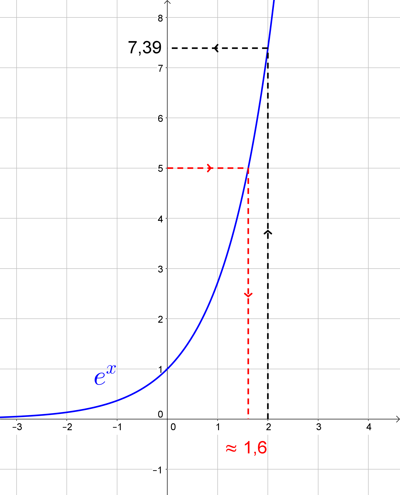
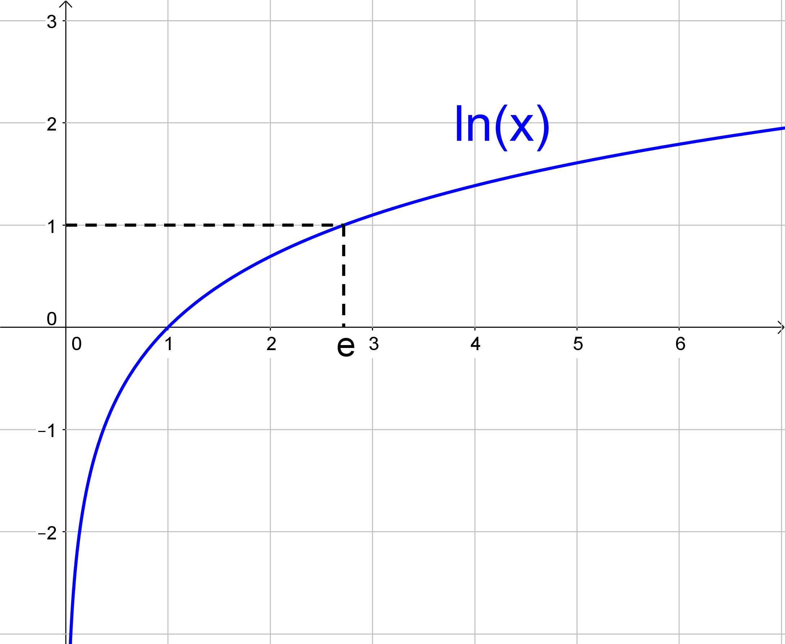

= [[Logarithmus]] Der natürliche Logarithmus und die Ableitung der allgemeinen Exponentialfunktion
:stem: 
:toc: left
:toc-title: Inhaltsverzeichnis
:sectnums:
:icons: font
:keywords: ableitung, Exponentialfunktion, ln, natürlicher Logarithmus

== Motivation

====
*Aufgabe:*

Die von Bakterien in einer Petri-Schale bedeckte Fläche soll durch die Funktion stem:[f(x)=e^x] beschrieben werden (stem:[x] in Stunden, stem:[f(x)] in stem:[cm^2]).

. Berechne, welche Fläche nach 2 Stunden bedeckt ist.
. Gib an, wann genau 5 stem:[cm^2] von den Bakterien bedeckt sind.
====

*Lösung:*

Um zu berechnen, welche Fläche nach 2 Stunden bedeckt ist, muss stem:[f(2)=e^2~~7,39] stem:[cm^2] berechnet werden.

Der umgekehrte Fall ist etwas kniffliger, denn zu lösen ist nun die Gleichung stem:[f(x)=5], also stem:[e^x=5].

Zeichnet man die Situation in ein Schaubild, so kann man die Aufgabe graphisch lösen:

Schwarz gestrichelt kann man den ersten Teil der Aufgabe erkennen: man startet bei der 2 auf der _x-Achse_ und erhält über den Graphen von f den y-Wert 7,39, wie oben berechnet.

Rot gestrichelt sieht man die Lösung zum zweiten Teil: nun starten wir bei 5 auf der _y-Achse_ und erhalten als x-Wert in etwas 1,6. Die Probe ergibt stem:[e^{1,6}~~4,953]. Wir sind also schon ziemlich nah dran, aber perfekt ist es noch nicht.

== Der natürliche Logarithmus

=== Definition
====
*Der natürliche Logarithmus*

Man nennt die Zahl, mit der man stem:[e] potenzieren muss, um a zu erhalten, den *natürlichen Logarithmus von a*, kurz stem:[ln(a)] (kleines L und kleines N für "logarithmus naturalis").

Diese Zahl ist auch die Lösung der Gleichung stem:[e^x=a] mit stem:[a>0], also stem:[e^{ln(a)}=a].
====
Eine alternative Bezeichnungsweise für den natürlichen Logarithmus ist der *Logarithmus zur Basis stem:[e]*, was auch als stem:[log_e(a)] bezeichnet werden könnte (sprich: "Logarithmus von a zur Basis e").

=== Logarithmus-Gesetze mit Beispielen
Der Logarithmus ist bereits von früher bekannt und von daher auch die Logarithmus-Gesetze, die unverändert auch für den natürlichen Logarithmus gelten:

====
*Logarithmus-Gesetze:*

. stem:[ln(a*b)=ln(a)+ln(b)]
. stem:[ln(a/b)=ln(a)-ln(b)]
. stem:[ln(a^b)=b*ln(a)] ("Hut-ab-Regel")
====

Dazu einige Beispiele:

* stem:[ln(x*e)=ln(x)+ln(e)=ln(x)+1]
* stem:[ln(1/e)=ln(1)-ln(e)=0-1=-1]
* stem:[ln(e^2)=2*ln(e)=2*1=2]

=== Lösung der Eingangsaufgabe

Mit Hilfe des natürlichen Logarithmus und seiner Gesetze können wir die Aufgabe von oben nun exakt lösen:

stem:[e^x=5 | ln]

stem:[ln(e^x)=ln(5)]

Mit dem 3. Logarithmus-Gesetz erhält man

stem:[x*ln(e)=ln(5)]

Nach der Definition des natürlichen Logarithmus ist stem:[ln(e)] die Zahl, mit der man stem:[e] potenzieren muss um stem:[e] zu erhalten. Das ist hier natürlich die 1, d. h. stem:[ln(e)=1]. Somit wird unsere Gleichung zu

stem:[x*1=x=ln(5)~~1,609]

=== Spezielle Werte des ln

Ein weiterer spezieller Wert des Logarithmus ist übrigens stem:[ln(1)], nämlich die Zahl, mit der man stem:[e] potenzieren muss, um 1 zu erhalten. Das ist die 0, denn stem:[e^0=1]. Somit gilt auch stem:[ln(1)=0].

====
*Einige besondere Werte des natürlichen Logarithmus:*

* stem:[ln(e)=1]
* stem:[ln(1)=0]
* stem:[ln(e^2)=2*ln(e)=2*1=2]
* stem:[ln(e^3)=3]
====

Für Werte kleiner gleich 0 ist der Logarithmus nicht definiert, da es auch keine Zahl gibt mit der man stem:[e] potenzieren kann, um etwas Negatives zu erhalten. Schließlich nimmt die e-Funktion auf dem gesamten Definitionsbereich stem:[RR] positive Werte an.

=== Exponentialgleichungen mit anderer Basis als e
====
*Aufgabe:*

Bestimme ein stem:[x] so, dass stem:[2^x=10] ist.
====

Eine direkte Lösung dafür wäre stem:[x=log_2 (10)], also der Logarithmus von 10 zur Basis 2. Leider gibt es nicht auf allen Taschenrechnern dafür eine entsprechende Taste. 

Probieren wir es mit dem natürlichen Logarithmus:

stem:[2^x=10 | ln]

stem:[ln(2^x)=ln(10)]

stem:[x*ln(2)=ln(10) | : ln(2)]

stem:[x={ln(10)}/{ln(2)}~~3,322]

Probe: stem:[2^{3,322}~~10,000], stimmt also.

Wenn man die 2 mit a und die 10 mit b ersetzt ergibt sich die Gleichung stem:[a^x=b] mit der Lösung stem:[x={ln(b)}/{ln(a)}]. Zusammengefasst:

====
*Allgemeine Exponentialgleichung:*

Die Gleichung

stem:[a^x=b] 

mit stem:[a, b>0] hat die Lösung

stem:[x={ln(b)}/{ln(a)}].

====

=== Graph der natürlichen Logarithmusfunktion

Der Graph der natürlichen Logarithmusfunktion sieht so aus:

Man sieht hier nochmal die besonderen Werte des natürlichen Logarithmus: stem:[ln(1)=0] und stem:[ln(e)=1].

Wie oben bereits erwähnt, ist er nur für positive x-Werte definiert und strebt für stem:[x->0] gegen stem:[-oo].

=== Die Ableitung der Logarithmusfunktion 

Wie üblich setzen wir an:

stem:[f'(x)=lim_{h->0} {ln(x+h)-ln(x)}/h],

wobei wir das 2. Logarithmusgesetz nutzen können und im Zähler stem:[ln(x+h)-ln(x)] als stem:[ln({x+h}/x)=ln(1+h/x)] schreiben können.

Nun ersetzen wir, wie bei der Herleitung der Ableitung der e-Funktion, alle stem:[h] durch stem:[1/n] und lassen das stem:[n->oo] laufen, anstatt das stem:[h->0]. Somit erhält man

stem:[f'(x)=lim_{n->oo} ln(1+1/{n*x})/{1/n}].

Anstatt durch stem:[1/n] zu dividieren kann man den Zähler auch mit stem:[n] multiplizieren, so dass man den Term

stem:[lim_{n->oo} n*ln(1+1/{n*x})]

erhält. Mit dem 3. Logarithmusgesetz erhält man

stem:[lim_{n->oo} ln((1+1/{n*x})^n)=lim_{n->oo} ln((1+{1/x}/n)^n)].

Da der ln selbst mit dem stem:[n] nichts zu tun hat, kann man den Limes in den ln ziehen und erhält als Ausdruck

stem:[ln(lim_{n->oo}(1+{1/x}/n)^n)]

Den inneren Teil kennen wir schon aus der Herleitung der Eulerschen Zahl. Dort wurde in der <<Ableitungen_Efunktion#Vertiefung,Vertiefung>> erwähnt, dass stem:[lim_{n->oo} (1+a/n)^{n}] gegen stem:[e^a] läuft. Bei uns entspricht das stem:[1/x] dem a, so dass der Ausdruck im ln für stem:[n->oo] gegen stem:[e^{1/x}] läuft. Also bleibt übrig:

stem:[f'(x)=ln(e^{1/x})=1/x * ln(e)=1/x*1=1/x]

Somit erhält man als überraschend einfaches Ergebnis für die 

====
*Ableitung der natürlichen Logarithmusfunktion:*

Die Ableitung von stem:[f(x)=ln(x)] ist stem:[f'(x)=1/x].
====

Um beispielsweise die Ableitung von stem:[f(x)=ln(x^2)] zu bestimmen, könnte man unter Einsatz der Kettenregel so vorgehen:

stem:[f'(x)=1/{x^2} *2x={2x}/{x^2}=2/x]

== Ableitung der allgemeinen Exponentialfunktion

Im <<Ableitungen_Efunktion#EFunktion,Kapitel über die e-Funktion>> war als Eingangsaufgabe die Ableitung von stem:[g(x)=2^x] zu bilden. Mit den Erkenntnissen aus diesem Kapitel ist es nun auch möglich, diese Aufgabe zu lösen. Zunächst formen wir den Term so um, dass die e-Funktion ins Spiel kommt:

stem:[g(x)=2^x=(e^{ln(2)})^x]

Diese Umformung stimmt, da stem:[e^{ln(2)}=2] ist. Mit dem Potenzgesetz stem:[(a^b)^c=a^{b*c}] kann man den Term noch umschreiben zu:

stem:[g(x)=e^{ln(2)*x}]

und diesen kann man mit Hilfe der Kettenregel ableiten zu

stem:[g'(x)=e^{ln(2)*x}*ln(2)=2^x*ln(2)],

womit die Aufgabe gelöst ist. Allgemein kann man formulieren:

====
*Ableitung einer Exponentialfunktion:*

Die Ableitung einer Exponentialfunktion der Form

stem:[f(x)=a^x] 

mit stem:[a>0] lautet

stem:[f'(x)=a^x * ln(a)=f(x)*ln(a)].