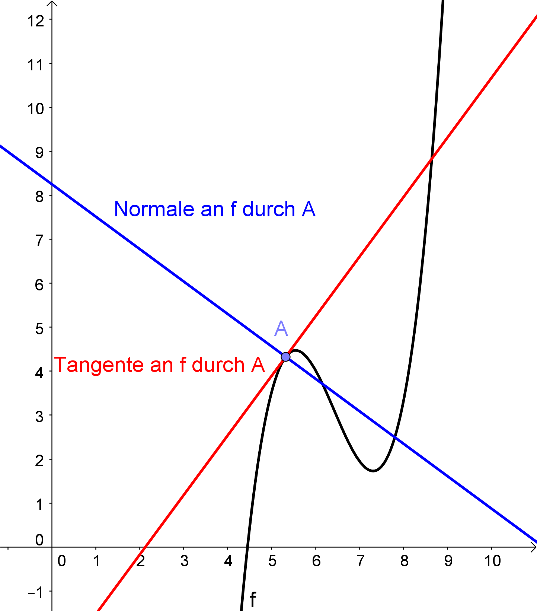
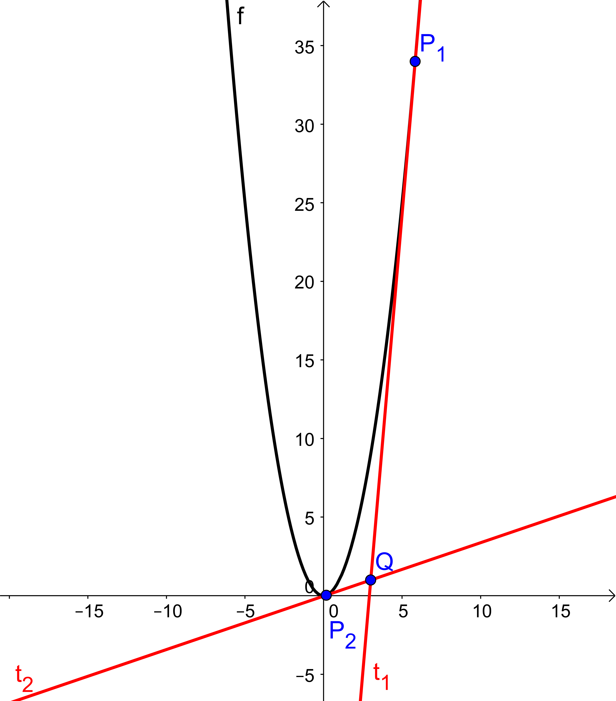

= [[Tangenten]]Tangenten und Normalen
:stem: 
:toc: left
:toc-title: Inhaltsverzeichnis
:sectnums:
:icons: font
:keywords: ableitung,  Tangente, Steigung

== Motivation

Mit Hilfe der ersten Ableitung kann man an einem Punkt im Graph einer Funktion stem:[f] die Steigung der Tangente durch diesen Punkt berechnen. Möchte man jedoch die Gleichung der Tangente aufstellen, so muss man noch weitere Schritte unternehmen. Dieses Kapitel erklärt Vorgehensweisen, um die Gleichungen von Tangenten und Normalen durch Punkte eines Graphen zu bestimmen.

== Begriffsklärung

Das folgende Schaubild zeigt die *Tangente* und die *Normale* an f in einem Punkt A:

.Funktion f mit Tangente und Normale in einem Punkt A

Die Tangente ist die Gerade, die in einem Punkt A des Graphen von f die gleiche Steigung hat wie der Graph selbst und durch den Punkt A verläuft, die Normale ist die Gerade durch A, die auf der Tangente senkrecht steht.

== Die Tangentengleichung

=== Herleitung

Da es sich bei Tangente und Normale jeweils um Geraden handelt, können die zugehörigen Terme über die allgemeine Geradengleichung stem:[y=m * x+c] bestimmt werden.

Im Fall der Tangente an einem Punkt stem:[A(u|f(u))] ist die Steigung stem:[m=f'(u)]. Somit kann man schreiben: 

stem:[y=f'(u)*x+c]. 

Zunächst scheinen drei Variablen, nämlich stem:[y], stem:[x] und stem:[c] unbekannt zu sein. Da man aber weiß, dass der Punkt A auf der Tangente liegt, muss dieser auch die Tangentengleichung erfüllen. Dadurch kann man für stem:[y=f(u)] schreiben und für stem:[x=u]. Man erhält durch dieses Einsetzen die Gleichung 

stem:[f(u)=f'(u)*u+c], 

wodurch ein Umformen nach stem:[c] den Ausdruck 

stem:[c=f(u)-f'(u)*u] 

liefert.

Setzt man dieses stem:[c] und stem:[m=f'(u)] in die allgemeine Geradengleichung stem:[y=m * x+c] ein, so erhält man für den Funktionsterm der Tangente 

stem:[t(x)=f'(u)*x+f(u)-f'(u)*u] 

und kann diesen Ausdruck über das Ausklammern von stem:[f'(u)] umformen zu 

stem:[t(x)=f'(u)*(x-u)+f(u)]. 

Diese Gleichung heißt

====
*Tangentengleichung:*

Die Gleichung der Tangente in einem Punkt stem:[A(u|f(u))] lautet

stem:[t(x)=f'(u)*(x-u)+f(u)].
====

=== Beispiele zur Tangentengleichung

====
*Aufgabe 1: Punkt auf dem Graphen gegeben*

Gegeben sei stem:[f(x)=x^2]. Bestimme die Gleichung der Tangente am Punkt stem:[P(3|f(3))].
====

*Lösung:*

*_Variante 1: Mit der Tangentengleichung_*

stem:[u=3], stem:[f(u)=f(3)=3^2=9].

stem:[f'(x)=2x], also ist stem:[f'(u)=f'(3)=2*3=6].

Einsetzen in die Tangentengleichung liefert: stem:[t(x)=6*(x-3)+9=6x-18+9=6x-9]

*_Variante 2: Mit der normalen Geradengleichung_*

stem:[y=m*x+c] mit stem:[m=f'(3)=6] (s. oben). Da der Punkt stem:[P(3|f(3)=9)] auf der Tangente liegt, gilt die Gleichung

stem:[9=6*3+c].

Somit gilt: stem:[c=9-18=-9], also erhält man als Tangentengleichung stem:[t(x)=6x-9].

====
*Aufgabe 2: Tangente von einem Punkt außerhalb des Graphen*

Gegeben sei stem:[f(x)=x^2]. Bestimme die Gleichung der Tangente an den Graph von stem:[f] durch den Punkt stem:[Q(3|1)] und die Punkte stem:[P], an denen die Tangente den Graph von stem:[f] berührt.
====

*Lösung:*

Der Punkt Q liegt _nicht_ auf dem Graph von stem:[f], allerdings muss er natürlich auch die Tangentengleichung erfüllen, so dass man durch Einsetzen von stem:[t(x)=1] und stem:[x=3] die Gleichung

stem:[1=f'(u)*(3-u)+f(u)]

erhält. Setzt man nun für stem:[f(u)=u^2] und für stem:[f'(u)=2u] ein, so gilt:

stem:[1=2u*(3-u)+u^2].

Diese Gleichung kann man nach kurzer Umformung mit Hilfe der Mitternachtsformel lösen:

stem:[1=6u-2u^2+u^2=6u-u^2]

Standardform aufstellen, stem:[u^2-6u+1=0], und einsetzen:

stem:[u_{1|2}={6+-sqrt{36-4*1*1}}/2={6+-4 sqrt{2}}/2]

ergibt stem:[u_1=3+2 sqrt(2)~~5,83] und stem:[u_2=3-2 sqrt(2)~~0,17].

Somit gibt es zwei mögliche Punkte, an denen eine Tangente durch den Punkt stem:[Q] den Graph von stem:[f] berührt, nämlich stem:[P_1(5,83|33,99)] und stem:[P_2(0,17|0,029)].

Somit lautet die Gleichung der einen Tangente 

stem:[t_1(x)~~2*5,83*(x-5,83)+33,99=11,66*x-67,98+33,99=11,66x-33,99]

und die der anderen analog dazu

stem:[t_2(x)~~2*0,17*(x-0,17)+0,029=0,34x-0,0578+0,029=0,34x-0,0288].

Im Schaubild sind die Lösungen nochmal visualisiert. Hier erkennt man auch, dass es tatsächlich _zwei_ Tangenten geben muss.

