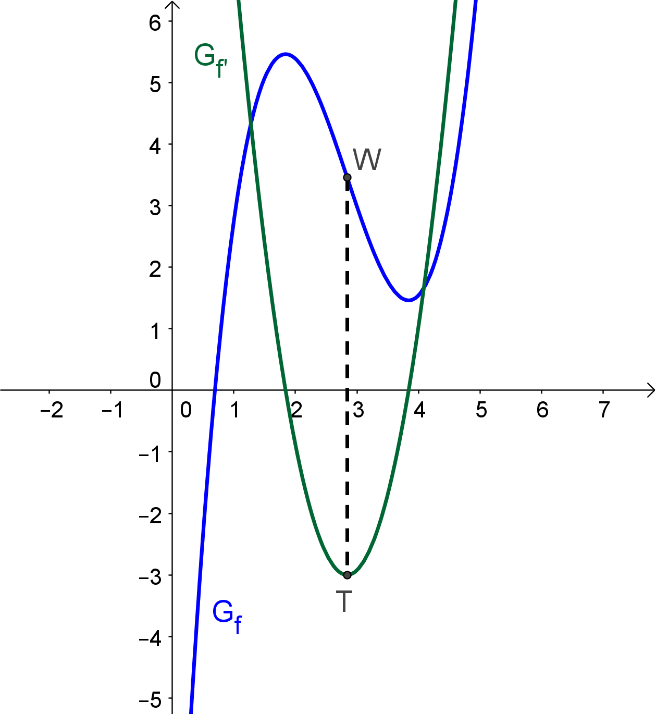

= [[Wendestellen]]Wendestellen
:stem: 
:toc: left
:toc-title: Inhaltsverzeichnis
:sectnums:
:icons: font
:keywords: ableitung,  zweite ableitung, hinreichende Bedingung, Extremstellen, Maximum, Minimum, Wendepunkt, Wendestelle

== Motivation

Neben den Stellen, an denen bei einer Funktion ein Minimum oder Maximum vorliegt, sind auch die Stellen von Interesse, an denen die Funktion das Krümmungsverhalten ändert, also z. B. im Graph der Übergang von einer Links- in eine Rechtskurve zu erkennen ist. Die Kenntnis über die Lage dieser Stellen ist hilfreich beim Zeichnen des Schaubilds.

Diese Stellen werden als *Wendestellen* bezeichnet.

== Hinreichende Bedingungen zum Auffinden von Wendestellen

Wir betrachten zunächst Stellen an denen eine Wendestelle vorliegt, die keine Sattelstelle ist. 

Solche Wendestellen zeichnen sich dadurch aus, dass die Steigung der betrachteten Funktion stem:[f] dort maximal bzw. minimal ist. Dies wird deutlich, wenn man neben dem Graphen der Funktion auch den Verlauf der ersten Ableitung einzeichnet:

.Eine Funktion mit einem Wendepunkt W und ihre erste Ableitung

Links vom Wendepunkt W beschreibt der Graph in diesem Beispiel eine Rechtskurve, rechts davon eine Linkskurve. Umso mehr man sich der Wendestelle von links nähert, desto negativer wird in diesem Beispiel die Steigung. Ist man über diese Stelle hinweg, wird der Graph von stem:[f] wieder weniger steil, die Steigung also positiver. Diese Tatsache ist auch am Graph der ersten Ableitung abzulesen: an der Wendestelle des Graphen von stem:[f] liegt ein Minimum von stem:[f'] vor.  

[TIP]
====
Man kann also sagen:

Um die Wendestellen einer Funktion stem:[f] aufzufinden, kann man auch die Extremstellen von stem:[f'] bestimmen.
====

Somit kann man die hinreichenden Bedingungen zum Auffinden von Extremstellen auf diesen Fall übertragen, wobei man nun aber nach den Extremstellen der ersten Ableitung sucht. Somit ersetzen wir in den hinreichenden Bedingungen jedes stem:[f'] mit stem:[f''] und jedes stem:[f''] mit stem:[f'''] und erhalten dadurch aus der ersten hinreichenden Bedingung für lokale Extremstellen:

====
*Erste hinreichende Bedingung für Wendestellen*

Gilt für eine Funktion stem:[f], dass

stem:[f''(x_0)=0]

*und*

der Graph von stem:[f''] bei stem:[x_0] einen Vorzeichenwechsel vorliegen hat,

*dann gilt:*

Bei stem:[x_0] liegt eine *Wendestelle* von stem:[f] vor.
====

Analog dazu geht aus der zweiten hinreichenden Bedingung für lokale Extremstellen dadurch hervor:

====
*Die zweite hinreichende Bedingung für Wendestellen*

Gilt für eine Funktion stem:[f], dass

stem:[f''(x_0)=0]

*und*

stem:[f'''(x_0)!=0] ,

*dann gilt:*

Bei stem:[x_0] liegt eine *Wendestelle* von stem:[f] vor.
====

Die zu den Wendestellen zugehörigen Punkte heißen *Wendepunkte*.

Eine besonderer Wendepunkt ist der *Sattelpunkt*: Hierbei handelt es sich um einen Wendepunkt, an dem die Tangente die Steigung 0 hat, also waagrecht verläuft. Dies kann man überprüfen, indem man den x-Wert des Wendepunkts in die erste Ableitung stem:[f'] einsetzt: ist sie dort 0, so liegt ein Sattelpunkt vor. 

== Übersicht über Extrem- und Wendestellen

link:Material/Ableitungen/Übersicht_Extremstelle_Wendestelle.pdf[Hier] noch eine Übersicht über den Zusammenhang zwischen den Ableitungen für Extrem- und Wendestellen.
