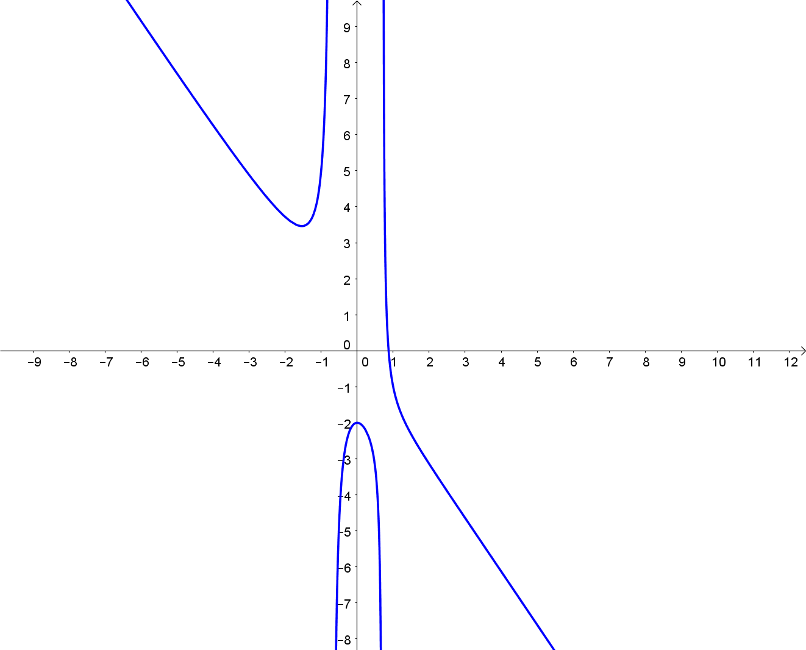

= [[Defintionsluecken]]Funktionen mit Definitionslücken
:stem: 
:toc: left
:toc-title: Inhaltsverzeichnis
:sectnums:
:icons: font
:keywords: Definitionslücken, gebrochen rationale Funktionen, Asymptote, hebbare Definitionslücken

== Motivation
Funktionen wie stem:[f(x)=1/x] sind nicht an jeder Stelle definiert: in diesem Beispiel ist die Stelle stem:[x=0] problematisch, da dies gleichbedeutend mit einer Division durch 0 ist, was nicht definiert ist.

In diesem Kapitel wird behandelt, wie mit Funktionen dieser Art umzugehen ist und wie sie sich verhalten, wenn die Funktionswerte gegen stem:[-oo] und stem:[+oo] laufen.

== Definitionslücken
Bei der Funktion stem:[f(x)={(x-1)(x+2)}/{(x-1)(x+1)(x-3)^2}] sind die x-Werte problematisch, für die der Nenner 0 wird. In diesem Fall sind das die Zahlen 1, -1 und 3. Dass für diese Werte vom Nenner der Wert 0 angenommen wird, ist in der *faktorisierten Schreibweise* des Nenners besonders einfach zu sehen, da man hier den Satz des Nullprodukts anwenden kann: wenn einer der drei Faktoren stem:[x-1], stem:[x+1] oder stem:[(x-3)^2] den Wert 0 annimmt, so wird dadurch der Nenner 0.

Hat man eine solche Funktion gegeben, gibt die Definitionsmenge stem:[D_f] die Menge der Zahlen an, die problemlos in stem:[f] eingesetzt werden können. In unserem Beispiel sind dies alle reellen Zahlen außer den genannten Werte 1, -1 und 3. In mathematischer Schreibweise notiert man diese Tatsache als stem:[D_f=RR\\{-1;1;3}], gesprochen als "R ohne ...".

Betrachtet man den Graphen von f, so sieht man, dass sich die *Definitionslücken* bei -1, 1 und 3 unterschiedlich äußern:

.Graph der Funktion f

=== Hebbare Definitionslücken
Im Term von f fällt auf, dass der Faktor stem:[(x-1)] in Zähler und Nenner gleichermaßen vorkommt, so dass man hier kürzen könnte. Das ist nur unter Beibehaltung der Definitionsmenge stem:[D_f] möglich, denn eine Funktion ist nicht nur über ihren Term, sondern auch über ihre Definitionsmenge festgelegt.

Würde man ohne Beachtung der Defintionslücken von f kürzen, so erhielte man stem:[{x+2}/{(x+1)(x-3)^2}], also eine Funktion, die bei stem:[x=1] unproblematisch ist, also nur den Definitionsbereich stem:[RR\\{-1;3}] hätte. Somit hätten wir aber die Funktion f geändert, da nun ein anderer Definitionsbereich vorliegt. 

Die Lösung besteht darin, dass man kürzen darf, den ursprünglichen Definitionsbereich aber beibehält, d. h.

stem:[f(x)={x+2}/{(x+1)(x-3)^2}] mit stem:[D_f=RR\\{-1;1;3}]

Im Graphen kennzeichnet man die Definitionslücke bei stem:[x=1] mit einem Kreis, der verdeutlichen soll, dass die Funktion an dieser Stelle nicht definiert ist.

Eine Definitionslücke, bei der die beschriebene Vorgehensweise möglich ist, heißt *hebbare Definitionslücke*.

=== Ungerade Polstelle
Die Definitionslücke bei stem:[x=-1] äußert sich im Graph in einer *Polstelle* mit Vorzeichenwechsel: nähert man sich von links der Stelle an, so divergiert der Graph gegen stem:[-oo], von rechts angenähert gegen stem:[+oo]. Mathematisch könnte man folgende Notation für diese Tatsache verwenden.

stem:[lim_{x -> -1-0} f(x) ->-oo] (Annäherung an -1 von links)

und

stem:[lim_{x->-1+0} f(x) ->+oo] (Annäherung an -1 von rechts)

Wie kommt es aber zu diesem Vorzeichenwechsel? An der Stelle -1 ändert im gesamten Term von f nur der Faktor stem:[x+1] im Nenner sein Vorzeichen, alles andere bleibt vom Vorzeichen her gleich, also muss an dieser Stelle ein Vorzeichenwechsel vorliegen.

Dieser Vorzeichenwechsel liegt immer dann vor, wenn die betrachtete Nullstelle im Nenner eine ungerade Potenz aufweist, in diesem Fall also die Potenz 1. Bei den Potenzen 3 oder 5 usw. läge ebenfalls eine Polstelle mit Vorzeichenwechsel vor. Man spricht hier auch von einer *ungeraden Polstelle*.

=== Gerade Polstelle
An der Stelle stem:[x=3] erkennt man eine *Polstelle* ohne Vorzeichenwechsel. Unabhängig davon, ob man sich der Stelle stem:[x=3] von links oder von rechts annähert, der Wert divergiert immer gegen stem:[+oo].

Der Grund liegt darin, dass die Nullstelle bei 3 eine *gerade Nullstelle* ist, d. h. eine gerade Hochzahl hat. In unserem Fall ist dies der Fall, da in stem:[f(x)={x+2}/{(x+1)(x-3)^2}] das stem:[(x-3)^2] eine gerade Potenz hat. Bei 3 wird dieser Faktor zwar 0, links und rechts davon ist er aber aufgrund der gerade Hochzahl positiv, d. h. auch die gesamte Funktion hat unmittelbar links und rechts von diesem Wert einen Funktionswert mit dem gleichen Vorzeichen.

Entsprechende nennt man eine solche Stelle auf der x-Achse eine *gerade Polstelle*.

=== Senkrechte Asymptote
Im Allgemeinen ist eine *Asymptote* ein Graph, dem sich der Graph einer Funktion beliebig nähert, diesen aber nie erreicht. In unserem Beispiel haben wir zwei problematische Stellen vorliegen, an denen sich der Funktionsgraph jeweils einer Senkrechten annähert. Diese senkrechten Geraden heißen in diesem Zusammenhang *senkrechte Asymptoten*. 

Hier haben sie die Funktionsterme stem:[x=-1] und stem:[x=3]. Der erste entspricht also der Menge aller Punkte, deren x-Wert -1 ist, also eine senkrechte Gerade bei x=-1, analog dazu die senkrechte Gerade bei x=3.

Zeichnet man diese senkrechten Asymptoten rot gestrichelt ein, so erhält man das folgende Schaubild:

.Graph der Funktion f mit den senkrechten Asymptoten x=-1 und x=3

== Verhalten gegen stem:[-oo] und stem:[+oo]

=== Gebrochenrationale Funktionen
==== Zählergrad kleiner als der Nennergrad
Im Beispiel zu den Definitionslücken konnten wir dem Schaubild entnehmen, dass der Graph sich für x-Werte gegen stem:[-oo] und stem:[+oo] jeweils der x-Achse annähern, also die x-Achse eine *waagrechte Asymptote* darstellt.

Warum ist dies der Fall?

Multipliziert man den Nenner aus, so erhält man stem:[f(x)={x+2}/{(x+1)(x-3)^2}={x + 2}/{x^{3} - 5  x^{2} + 3 x + 9}]. Im Zähler und Nenner liegt jeweils eine <<Funktionseigenschaften_Symmetrie.adoc#GR, ganzrationale Funktion>> vor, im Zähler vom Grad 1 und im Nenner vom Grad 3. Eine solche Funktion heißt auch *gebrochenrationale Funktion*. Klammert man aus Zähler und Nenner nun jeweils stem:[x^3] aus (hoch 3, da dies der höchste Grad von Zähler und Nenner ist) und betrachtet den Grenzwert für stem:[x->  oo], so erhält man:

stem:[lim_{x-> oo} f(x)=lim_{x-> oo}{x + 2}/{x^{3} - 5  x^{2} + 3 x + 9}=]

stem:[lim_{x->oo} {x^3 * (1/x^2 +2/x^3)}/{x^3*(1-5/x+3/x^2+9/x^3)}=lim_{x-> oo} { 1/x^2 +2/x^3}/{1-5/x+3/x^2+9/x^3}]

Man sieht: der Zähler geht hier für stem:[x->oo] gegen 0, der Nenner gegen einen Wert ungleich 0. Insgesamt geht der Funktionswert somit gegen 0. Den gleichen Sachverhalt erhält man für stem:[x->-oo].

Dieses Verfahren funktioniert immer dann, wenn eine gebrochenrationale Funktion vorliegt, bei der der Grad des Zählers kleiner als der Grad des Nenners ist.

==== Zählergrad gleich dem Nennergrad
Was passiert im Fall stem:[g(x)={4x-1}/{2x+5}], wenn also Zälher- und Nennergrad gleich sind, wie hier 1?

Wendet man das Verfahren des vorangegangenen Abschnitts an, so erhält man:

stem:[lim_{x->oo} g(x)=lim_{x->oo}{4x-1}/{2x+5}=lim_{x->oo}{x*(4-1/x)}/{x*(2+5/x)}=]

stem:[lim_{x->oo}{4-1/x}/{2+5/x}=4/2=2]

Das gleiche Ergebnis erhält man wieder für stem:[x->-oo].

Man erhält auch hier wieder eine waagrechte Asymptote, stem:[y=2], wobei man die 2 schnell erhält, indem man die Koeffizienten der höchsten Potenzen in Zähler und Nenner durcheinander dividiert.

Das Schaubild sieht so aus:

.In rot die waagrechte Asymptote mit y=2

Zum Verständnis noch ein weiteres Beispiel dazu:

stem:[{6x^7-4x^3+3x-5}/{2x^7-5x^4+9x^3-11x+3}] hat im Zähler und Nenner die gleiche Potenz 7. Für die waagrechte Asymptote erhält man also den Term stem:[y=6/2=3], wobei die 6 der Koeffizient der höchsten Potenz im Zähler ist und die 2 der Koeffizient der höchsten Potenz des Nenners.

Somit erhält man für den Fall, dass der Zähler- dem Nennergrad entspricht ebenfalls eine waagrechte Asymptote, die aber ungleich der x-Achse ist, wie man auch deutlich im Schaubild erkennen kann:

.In rot hier die waagrechte Asymptote mit y=3

==== Zählergrad größer als der Nennergrad
Dies ist der letzte mögliche Fall für gebrochenrationale Funktionen. In diesem Fall dominiert der Zähler über den Nenner, d. h. die Funktion divergiert für große Werte von x gegen stem:[+oo] oder stem:[-oo]. Am deutlichsten dürfte dieser Sachverhalt anhand eines Beispiels werden:

stem:[lim_{x->oo} h(x)=lim_{x->oo}{3x^3-2}/{-2x^2+1}]

Der Zähler geht hier gegen stem:[+oo], da vor dem stem:[x^3] ein positiver Koeffizient steht und das stem:[x^3] selbst gegen stem:[+oo] läuft. Der Nenner geht gegen stem:[-oo], denn stem:[x^2] geht für große x zwar gegen stem:[+oo], das negative Vorzeichen negiert jedoch den Wert. Letzten Endes geht es also um stem:[{+oo} / {-oo}]. Da der Zählergrad höher ist als der Nennergrad, dominiert der Zähler und insgesamt geht der Term gegen stem:[-oo] ( + durch - ergibt -).

Für stem:[x->-oo] ist die Argumentation ähnlich: der Zähler geht gegen stem:[-oo], der Nenner wieder gegen stem:[-oo]. Da der Zähler wieder dominiert (Zählergrad größer als der Nennergrad), geht die Funktion insgesamt gegen stem:[+oo] ( - durch - gibt +).

Hier das zugehörige Schaubild:

.Zählergrad größer als der Nennergrad

==== Zusammenfassung für gebrochenrationale Funktionen

====
*Verhalten von gebrochenrationalen Funktionen für stem:[x-> +-oo]*:

* Zählergrad < Nennergrad

x-Achse ist die waagrechte Asymtpote

* Zählergrad = Nennergrad

Waagrechte Asymptote, deren y-Wert über den Quotienten der Koeffizienten der höchsten Potenzen bestimmt werden kann.

* Zählergrad > Nennergrad

Hier divergiert die Funktion für vom Betrag her große x-Werte gegen stem:[+oo] oder stem:[-oo], was im Einzelnen überprüft werden muss.

====

=== e-Funktion und ganzrationale Funktionen kombiniert für stem:[x->+-oo]
Bisher hatten wir nur gebrochenrationale Funktionen für ihr Verhalten gegen stem:[+-oo] betrachtet. Ein weiteres Beispiel wäre aber stem:[f(x)={x^7+3x}/{e^x}]. Wie verhält sich diese Funktion für große Zahlen?

Dazu ein interessanter Beweis:

*Behauptung:* 

Die e-Funktion steigt für stem:[x->oo] stärker als jede ganzrationale Funktion.

*Beweis:*

Wir definieren für unseren Beweis die Funktion stem:[q(x)={x^{n+1}*e^{-x}}/{(n+1)^{n+1}*e^{-(n+1)}}] und zeigen nun, dass diese für x>0 maximal 1 wird. 

Dazu bilden wir zunächst die Ableitung nach x:

stem:[q'(x)={(n+1)*x^n*e^{-x}+e^{-x}*(-1)*x^{n+1}}/{(n+1)^{n+1}*e^{-(n+1)}}]

Dazu haben wir im Zähler die Produktregel verwendet. Im Nenner kommt kein x vor, so dass keine Quotientenregel notwendig war.

Die Ableitung können wir vereinfachen zu:

stem:[q'(x)={(n+1-x)*x^n * e^{-x}}/{(n+1)^{n+1} *e ^{-(n+1)}}]

Nun bestimmen wir das Maximum von q(x), indem wir zunächst stem:[q'(x)=0] setzen.

Die einzige Lösung dieser Gleichung ist stem:[x=n+1], da stem:[e^-x] und stem:[x^n] für x>0 (Voraussetzung) immer größer als 0 sind.
Da es sich um eine einfache Nullstelle handelt, findet hier für stem:[q'] ein Vorzeichenwechsel von + nach - statt, so dass bei stem:[x=n+1]  ein Maximum vorliegt.

Bestimmen wir nun den y-Wert des Hochpunkts:

stem:[q(n+1)={(n+1)^{n+1}*e^{-(n+1)}}/{(n+1)^{n+1}*e^{-(n+1)}}=1]

Somit ist stem:[q(x)<=1] für x>0, also stem:[{x^{n+1}*e^{-x}}/{(n+1)^{n+1}*e^{-(n+1)}}<=1].

Multipliziert man diese Gleichung mit dem Nenner der linken Seite und dividiert sie anschließend durch x, so erhält man

stem:[x^n * e^{-x} <= {(n+1)^{n+1}*e ^{-(n+1)}}/x]

Für stem:[x->oo] geht die rechte Seite gegen 0 (oben steht ein konstanter Wert, der durch immer größere Werte dividiert wird).

Da die linke Seite kleiner gleich der rechten Seite war, muss auch sie gegen 0 gehen (negativ kann sie nicht werden).

Somit haben wir gezeigt:

====
stem:[lim_{x->oo} x^n*e^{-x}= lim_{x->oo} {x^n}/{e^x}=0] bzw. stem:[lim_{x->-oo} x^n * e^x=0].

Mit anderen Worten: Die e-Funktion steigt stärker als jede ganzrationale Funktion.
====

Benutzen wir diese Erkenntnis für unser Beispiel: stem:[f(x)={x^7+3x}/{e^x}].

* stem:[lim_{x->oo} f(x)=0], da die e-Funktion stärker als jede ganzrationale Funktion steigt, wie wir soeben gezeigt haben.

* stem:[lim_{x->-oo} f(x)->-oo], da der Nenner von oben gegen 0 geht (also immer positiv ist) und der Zähler gegen stem:[-oo] läuft, so dass die Funktion insgesamt gegen stem:[-oo] geht.

