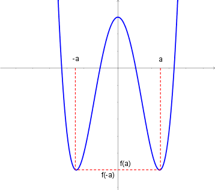
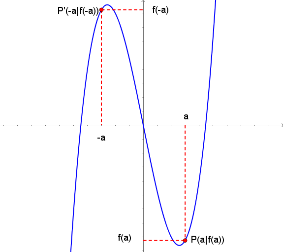

= [[Symmetrie]]Symmetrie
:stem: 
:toc: left
:toc-title: Inhaltsverzeichnis
:sectnums:
:icons: font
:keywords: Symmetrie, Achsensymmetrie, Punktsymmetrie

== Motivation

Erkenntnisse über die Symmetrieeigenschaften eines Graphen können nützlich sein, um diesen zu zeichnen. 

In unserem Fall behandeln wir nur die Achsensymmetrie zur y-Achse und die Punktsymmetrie zum Ursprung. Auch Symmetrien zu anderen Achsen und Punkten wären jedoch denkbar.

== Achsensymmetrie zur y-Achse

=== Definition
.Achsensymmetrie

Weist der Graph einer Funktion eine *Achsensymmetrie zur y-Achse* auf, so befindet sich neben einem Punkt stem:[P(a|f(a))] auch der an der y-Achse gespiegelte Punkt stem:[P'(-a|f(a))] auf dem Graph. Dies gilt für alle Werte von stem:[a].

Aus dem Schaubild kann man entnehmen, dass im Falle der Achsensymmetrie stets stem:[f(-a)=f(a)] ist.

Somit gilt:

====
*Achsensymmetrie zur y-Achse*

Wenn man nachweisen kann, dass stem:[f(-a)=f(a)] für alle stem:[a in D], dann ist der stem:[G_f], also der Graph von f, *achsensymmetrisch zur y-Achse*.
====

=== Beispiele zum Nachweis der Achsensymmetrie
Überprüfe die folgenden Beispiele auf Achsensymmetrie zur y-Achse:

* stem:[f(x)=x^4-x^2+1]
* stem:[g(x)=e^x+e^{-x}]

*Lösung:*

* stem:[f(-x)=(-x)^4-(-x)^2+1=x^4-x^2+1=f(x)]

Da stem:[f(-x)=f(x)] gilt, unabhängig vom Wert von x, ist der Graph der Funktion f achsensymmetrisch zur y-Achse.

* stem:[g(-x)=e^{-x}+e^{-(-x)}=e^{-x}+e^x=g(x)]

Auch hier gilt wieder, dass stem:[g(-x)=g(x)] ist, so dass auch stem:[G_g] achsensymmetrisch zur y-Achse ist.

== Punktsymmetrie zum Ursprung
=== Definition
.Punktsymmetrie

Analog wir bei der Achsensymmetrie zur y-Achse muss für jeden Punkt stem:[P(a|f(a))] gelten, dass auch sein Spiegelpunkt stem:[P'(-a|f(-a))] auf dem Graph liegt, wobei nun gelten muss, dass stem:[f(-a)=-f(a)] ist für alle a aus dme Definitionsbereich.

====
*Punktsymmetrie zum Ursprung*

Wenn für alle stem:[a in D] gilt, dass stem:[f(-a)=-f(a)] ist, so ist stem:[G_f] *punktsymmetrisch zum Ursprung*.
====

=== Beispiele zum Nachweis der Punktsymmetrie
Überprüfe die folgenden Beispiele auf Punktsymmetrie zum Ursprung:

* stem:[f(x)=-x^3+x]
* stem:[g(x)=x^2 / {x^3-x}]

*Lösungen:*

* stem:[f(-x)=-(-x)^3+(-x)=-(-x^3)-x=x^3-x=]

stem:[=-(-x^3+x)=-f(x)]

Somit ist die Bedingung stem:[f(-x)=-f(x)] für die Punktsymmetrie im Ursprung erfüllt.

* stem:[g(-x)=(-x)^2 /{(-x)^3-(-x)}=x^2 / {-x^3+x}=]

stem:[=x^2/ {-(x^3-x)}=- {x^2}/{x^3-x}=-g(x)]

Somit ist auch der Graph dieser Funktion punktsymmetrisch zum Ursprung.

== [[GRF]]Ganzrationale Funktionen und Symmetrie
Funktionen der Form stem:[a_n*x^n+a_{n-1}*x^{n-1}+...+a_1*x^1+a_0] mit stem:[a_n!=0, a_i in RR (iin {0,1,2, ...,n}), n in NN] heißen *ganzrationale Funktionen vom Grad n*. Der *Grad* entspricht hierbei der höchsten vorkommenden Potenz.

*Beispiele:*

* stem:[f(x)=x^3+2x-1] ist eine ganzrationale Funktion vom Grad 3.
* stem:[g(x)=-2x^2+4x^7] ist eine ganzrationale Funktion vom Grad 7.
* stem:[2x^0=2] ist eine ganzrationale Funktion vom Grad 0.

Mit den Definitionen der vorangegangenen Artikeln wird deutlich: 

====
*Symmetrie bei ganzrationalen Funktionen*

Eine ganzrationale Funktion, in der nur ungerade Potenzen vorkommen, ist punktsymmetrisch zum Ursprung, eine mit ausschließlich geraden Potenzen hingegen achsensymmetrisch zur y-Achse.
====

*Beispiele:*

* stem:[f(x)=x^7+x^5-2x] enthält nur ungerade Hochzahlen (stem:[2x=2x^1]), wodurch stem:[G_f] punktsymmetrisch zum Ursprung ist.
* stem:[g(x)=x^4-2] enthält nur gerade Hochzahlen (stem:[-2=-2x^0], wobei die Null zu den geraden Zahlen gehört), wodurch stem:[G_g] achsensymmetrisch zur y-Achse ist.
* stem:[h(x)=x^3-x^2] enthält gerade und ungerade Hochzahlen, so dass stem:[G_h] weder achsensymmetrisch zur y-Achse noch punktsymmetrisch zum Ursprung ist.

== Sinus und Kosinus

====
*Symmetrie des Sinus und Kosinus:*

Es gilt:

stem:[cos(-x)=cos(x)] (punktsymmetrisch zum Ursprung) 

und 

stem:[sin(-x)=-sin(x)] (achsensymmetrisch zur y-Achse).
====

