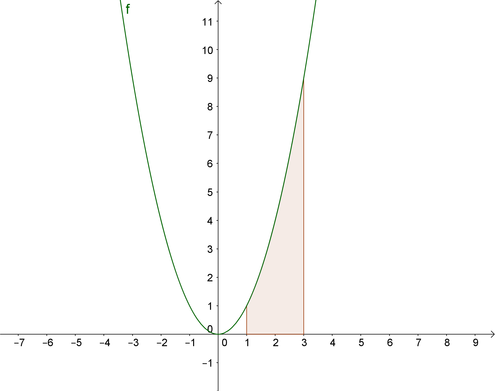

= [[Integrale_Einfuehrung]] Einführung in die Integralrechnung
:stem: 
:toc: left
:toc-title: Inhaltsverzeichnis
:sectnums:
:icons: font
:keywords: ableitung, Exponentialfunktion

++++
 
++++

== Motivation

====
*Beispielaufgabe aus Klasse 7*

Petra möchte ein Bad nehmen und lässt in die zu Beginn leere Badewanne 5 Minuten lang Wasser mit der Fließgeschwindigkeit stem:[z(t)=20] ein, wobei die Fließgeschwindigkeit in stem:[l/min] angegeben wird.

Als sie nach dem Bad den Stöpsel zieht, fließt das Wasser mit konstanter Fließgeschwindigkeit wieder ab, so dass die Badewanne nach 10 Minuten geleert ist.

. Zeichne das Schaubild des aktuellen Wasserstands in der Badewanne beim Einlassen des Wasssers und in das gleiche Koordinatensystem das Schaubild der zugehörigen Fließgeschwindigkeit zu jedem Zeitpunkt. Bestimme für beide Schaubilder die zugehörigen Funktionsterme Z(t) für den Wasserstand zum Zeitpunkt t und z(t) für die Fließgeschwindigkeit zum Zeitpunkt t.

. Wiederhole diese Schritte für den Fall des Abfließens des Wassers. Gib entsprechend die Funktionsterme A(t) und a(t) an.
====

*Lösung:*

*Teilaufgabe 1:*

[Zufluss]
.Schaubild für den Wasserstand Z(t) und die Fließgeschwindigkeit z(t)
image::Bilder/Integrale/Zufluss_Badewanne.png[Zufluss]

Der Term für die Fließgeschwindigkeit lautet stem:[z(t)=20], der für den Wasserstand zum Zeitpunkt t stem:[Z(t)=20*t].

*Teilaufgabe 2:*

Zu Beginn des Abfließens sind 100 Liter in der Badewanne, wobei sich diese in 10 Minuten vollständig entleert, so dass 10 stem:[l/min] abfließen. Das entspricht bereits dem Funktionsterm von stem:[a(t)=-10]. Das negative Vorzeichen kommt dadurch zustande, dass das Abfließen von Wasser einem negativen Zufluss entspricht.

Für den Funktionsterm des aktuellen Wasserstands gilt in diesem Fall stem:[A(t)=100-10*t], da zu Beginn 100 Liter in der Badewanne sind und pro Minute 10 Liter abfließen.

[Abfluss]
.Schaubild für den Wasserstand A(t) und die Fließgeschwindigkeit a(t)
image::Bilder/Integrale/Abfluss_Badewanne.png[Abfluss]

== Zusammenhang zwischen z(t) und Z(t)
=== Graphischer Zusammenhang

Die Aufgaben aus dem letzten Abschnitt führen zu der Frage, inwieweit diese Aufgaben einem neuen Themengebiet, namentlich der _Integralrechnung_ zuzuordnen sind, da sie beide komplett mit bisherigen Mitteln zu lösen sind.

Um diese Frage zu klären, soll nun der Zusammenhang zwischen z(t) und Z(t) genauer betrachtet werden: Z(t) liefert für einen eingesetzten Wert t den Wasserstand in Litern zu diesem Zeitpunkt zurück. So ist beispielsweise stem:[Z(2)=40], was nichts anderes bedeutet, als dass 2 Minuten nach Beginn des Einfließens des Wassers 40 Liter in der Badewanne sind.

Diesen Wert kann man auch über stem:[z(t)=20] erhalten, denn z(t) liefert zu jedem Zeitpunkt die momentane Zuflussgeschwindigkeit in Litern pro Minute zurück. In unserem einfachen Fall sind das immer stem:[20 l/min]. Nach zwei Minuten sind also stem:[2*20 min * l/min=40 l] in die Badewanne geflossen. Da diese anfangs leer war, entsprechen diese 40 Liter dem Wasserstand in der Badewanne zum Zeitpunkt 2 Minuten.

Wir haben also die momentane Zuflussgeschwindigkeit mit der Dauer des Zuflusses multipliziert, was man graphisch als Rechtecksfläche interpretieren kann:

[Zusammenhang]
.Zusammenhang zwischen z(t) und Z(t)
image::Bilder/Integrale/Zufluss_Badewanne_Zusammenhang.png[Zusammenhang]

Und diese Rechtecksfläche entspricht dem Funktionswert von Z(2). Man kann Z(t) also als Maß für den Flächeninhalt interpretieren, der vom Schaubild von z(t) und der t-Achse im Intervall von 0 bis t eingeschlossen wird. Somit entspricht jeder Funktionswert Z(t) dem Flächeninhalt unter z(t) zwischen 0 und t.

Um den Flächeninhalt der Fläche zwischen dem Graphen einer Funktion f(x) und der x-Achse auf dem Intervall [a ; b] zu beschreiben, gibt es eine spezielle Schreibweise, nämlich

stem:[int_a^b f(x) dx]

a und b sind hier die untere und die obere *Integrationsgrenze*, f(x) heißt in diesem Zusammenhang *Integrand* und der gesamte Ausdruck wird gesprochen als "Integral von a bis b über f(x) dx". Das "dx" legt fest, über welche Variable integriert wird, hier ist die *Integrationsvariable* somit x.

Auf unser Beispiel angewendet würde das für die Fläche stem:[A_1] bedeuten:

stem:[A_1=int_0^2 z(t) dt].

Das steht also für die Fläche zwischen dem Graph von z(t) und der t-Achse (daher auch dt und nicht dx) auf dem Intervall von 0 bis 2 und entspricht somit der schraffierten Fläche stem:[A_1] im Schaubild.

Weitere Beispiele wären:

* stem:[int_1^3 z(t) dt = 40]
* stem:[int_2^2 z(t) dt = 0] (das eingeschlossene Rechteck hat die Breite 0)
* stem:[int_3^1 z(t) dt=-40] (hier wird von rechts nach links integriert, so dass ein negativer Flächeninhalt herauskommt)

Wie man am letzten Beispiel sieht, liefert das Integral nicht den geometrischen Flächeninhalt der eingeschlossenen Fläche zurück, der immer positiv wäre, sondern den sogenannten *orientierten Flächeninhalt*, der auch negative Werte annehmen kann.

Das Beispiel stem:[int_1^3 z(t) dt] entspricht der Wassermenge, die zwischen der ersten und der dritten Minute hinzugekommen ist. Eine alternative Möglichkeit der Berechnung wäre, von der Wassermenge zum Zeitpunkt t=3 die Wassermenge zum Zeitpunkt t=1 abzuziehen, also stem:[int_1^3 z(t) dt=Z(3)-Z(1)] zu berechnen. Für unser Beispiel lässt sich also verallgemeinern:

====
stem:[int_a^b z(t) dt = Z(b) - Z(a)]
====

Überprüfen wir unsere Erkenntnisse an einem zweiten Beispiel, nämlich an den Graphen der Funktionen a(t) und A(t):

stem:[int_2^4 a(t) dt = A(4) - A(2) = 60 - 80 = -20]

Alternativ hätten wir auch den orientierten Flächeninhalt auf dem Intervall von 2 bis 4 zwischen dem Graph von a(t) und der t-Achse berechnen können, was stem:[int_2^4 a(t) dt = -10 * (4-2)= -20] liefert. Beachte, dass auch hier wieder ein negativer Flächeninhalt auftritt. Zwar wurde diesmal von links nach rechts integriert, allerdings für Werte unter der t-Achse, so dass auch hier ein negativer Zahlenwert sinnvoll ist.

=== Zusammenhang über die Ableitung

Ein weiterer Zusammenhang, der vielleicht schon aufgefallen ist, ist die Tatsache, dass z(t)=Z´(t) ist, denn

stem:[Z(t)=20*t]

stem:[Z´(t)=20=z(t)]

Dies gilt auch für den Zusammenhang zwischen a(t) und A(t), denn

stem:[A(t)=100-10*t]

stem:[A´(t)=-10=a(t)]

Ist dies ein seltsamer Zufall oder lässt sich dieser Zusammenhang über die Ableitung verallgemeinern?

=== Hauptsatz der Differenzial- und Integralrechnung

Um die Vermutung aus dem letzten Abschnitt zu beweisen, führen wir zunächst eine spezielle Funktion ein, nämlich die *Integralfunktion* stem:[I_a(t)=int_a^t f(x) dx]. Sie liefert den Flächeninhalt zwischen der Funktion f(x) und der x-Achse zurück, wobei die linke Integrationsgrenze festgelegt ist (hier a) und die rechte jeden beliebigen Wert annehmen kann. Ein Beispiel für diese Integralfunktion hatten wir schon in der Einführungsaufgabe:

stem:[int_0^t z(t) dt=Z(t)-Z(0)=Z(t)]

Das bedeutet, dass Z(t) dem Flächeninhalt zwischen der festen unteren Grenze 0 und der variablen oberen Grenze t entspricht. So gilt z. B.

* stem:[Z(2)=int_0^2 z(t) dt]
* stem:[Z(3)=int_0^3 z(t) dt]
* usw.

Somit entspricht stem:[Z(t)] der Integralfunktion stem:[I_0(t)=int_0^t z(t) dt].

Nun wollen wir für unseren speziellen Fall zeigen, dass gilt: stem:[Z´(t)=z(t)] mit stem:[Z(t)=I_0(t)=int_0^t z(t) dt]. Wir müssten also zeigen, dass die Ableitung von stem:[int_0^t z(t) dt] die Funktion stem:[z(t)] selbst ergibt.

Genau das zeigt der 

====
*Hauptsatz der Differenzial- und Integralrechnung:*

Bildet man die Ableitungsfunktion der Integralfunktion stem:[I_a(x)=int_a^x f(t) dt], so erhält man die Integrandenfunktion f, kurz: stem:[I_a´(x)=f(x)].

Dabei muss _f stetig_ sein, wodurch stem:[I_a] _differenzierbar_ ist.

====

[NOTE]
====
Beachte, dass hier stem:[I_a(x)=int_a^x f(t) dt] statt stem:[I_a(x)=int_a^x f(x) dx] verwendet wird. Beide Ausdrücke sind formal identisch, allerdings erleichtert die Einführung des t als Integrationsvariable die Unterscheidung zwischen der Integrationsvariable t und der oberen variablen Grenze x.
====

*Beweis:*

Leiten wir stem:[I_a(x)] ab:

stem:[I_a´(x)=lim_{h->0} {I_a(x+h)-I_a(x)}/h]

Setzt man die Definition stem:[I_a(x)=int_a^x f(t) dt] der Integralfunktion ein, so erhält man

stem:[lim_{h->0} {int_a^{x+h} f(t) dt-int_a^x f(t) dt}/h]

Der Zähler lässt sich als stem:[int_a^{x+h} f(t) dt-int_a^x f(t) dt=int_x^{x+h}f(t)dt] schreiben, wie man aus der Grafik ablesen kann, denn von der gesamten Fläche stem:[int_a^{x+h} f(t) dt] (alles, was blau schraffiert ist) wird die rot schraffierte Fläche stem:[int_a^x f(t) dt] abgezogen, wodurch die ausschließlich blau schraffierte Fläche übrigbleibt, die durch das Integral stem:[int_x^{x+h}f(t)dt] beschrieben wird:

[Linearitaet]
.Veranschaulichung von stem:[int_a^{x+h} f(t) dt-int_a^x f(t) dt]
image::Bilder/Integrale/Linearitaet.png[Linearitaet]

Somit erhalten wir für die Ableitung der Integralfunktion den Ausdruck

stem:[I_a´(x)= lim_{h->0} {int_x^{x+h}f(t)dt}/h]

Leider können wir mit dem x+h als obere Grenze nicht weiterkommen und bedienen uns des folgenden Tricks:

Da f nach Voraussetzung stetig ist (in unserem Fall bedeutet das "durchgängig zeichenbar"), so existiert ein Wert stem:[z in [x ; x+h]] mit stem:[f(z)*h=int_x^{x+h} f(t)dt].

Das bedeutet, dass es ein Rechteck der Breite h und der Höhe f(z) gibt (mit z zwischen x und x+h), so dass der Flächeninhalt dieses Rechtecks dem Wert des Integrals entspricht.

Graphisch kann man an unserem Beispiel zeigen, dass es einen Wert k auf [x ; x+h] gibt, so dass der Flächeninhalt des Rechtecks der Breite h und der Höhe f(k) auf jeden Fall _kleiner oder gleich_ dem gesuchten Flächeninhalt stem:[int_x^{x+h}f(t)dt] ist. Zum Beispiel wählt man dazu die Stelle k auf der x-Achse, an der der Funktionswert von f minimal wird.

[zuKlein]
.Flächeninhalt des Rechtecks der Breite h und der Höhe f(k) ist kleiner gleich dem Wert des Integrals stem:[int_x^{x+h}f(t)dt]
image::Bilder/Integrale/zuKlein.png[zuKlein]

Ebenso ist in diesem Beispiel der Flächeninhalt des Rechtecks, das in diesem graphischen Beispiel die Höhe f(x) hat, _größer gleich_ dem Wert des Integrals:

[zuGross]
.Flächeninhalt des Rechtecks der Breite h und der Höhe f(x) ist größer gleich dem Wert des Integrals stem:[int_x^{x+h}f(t)dt]
image::Bilder/Integrale/zuGross.png[zuGross]

Da f stetig ist, werden auch alle Zwischenwerte zwischen f(k) und f(x) angenommen, so dass es einen Wert z gibt, der auf jeden Fall zwischen x und x+h liegt und für den der Flächeninhalt des Rechtecks der Breite h und der Höhe f(z) genau dem Wert des Integrals entspricht:

[genauRichtig]
.Flächeninhalt des Rechtecks der Breite h und der Höhe f(z) ist gleich dem Wert des Integrals stem:[int_x^{x+h}f(t)dt]
image::Bilder/Integrale/genauRichtig.png[genauRichtig]

Insgesamt verhilft uns diese Erkenntnis dazu, den Term stem:[I_a´(x)= lim_{h->0} {int_x^{x+h}f(t)dt}/h] wegen stem:[f(z)*h=int_x^{x+h} f(t)dt] umzuschreiben zu

stem:[I_a´(x)= lim_{h->0} {f(z)*h}/h=lim_{h->0}f(z)]

Da wir wissen, dass stem:[x <= z <= x+h] ist, d. h. mit stem:[h->0] läuft auch stem:[z->x]. Da f eine stetige Funktion ist, gilt dadurch auch, dass stem:[lim_{h->0} f(z)=lim_{z->x}f(z)=f(x)] ist.

Damit haben wir gezeigt, dass stem:[I_a´(x)=f(x)] ist, was zu beweisen war.

Bezogen auf unser Beispiel mit dem Zufluss des Wassers in die Badewanne bedeutet das, dass stem:[Z´(t)=z(t)] ist, was wir schon zu Beginn vermutet hatten.

== Die Stammfunktion

====
*Stammfunktion*

Eine Funktion F(x) heißt *Stammfunktion von f(x)*, wenn gilt, dass F´(x)=f(x).
====

Bezogen auf unser Badewannenbeispiel ist die Funktion Z(t) (also die Funktion, die zu jedem Zeitpunkt den Wasserstand zurückgibt) die Stammfunktion von z(t) (die Funktion, die zu jedem Zeitpunkt die momentane Änderungsrate zurückliefert).

Denn stem:[Z(t)=20*t] und stem:[Z´(t)=20=z(t)], was nach Definition bedeutet, das Z(t) die Stammfunktion von z(t) ist.

Um eine Stammfunktion F(x) einer Funktion f(x) zu erhalten muss man f(x) "rückwärts ableiten". Ein Beispiel soll das veranschaulichen:

stem:[f(x)=cos(x)]

Nun sucht man als Stammfunktion eine Funktion, die abgeleitet stem:[cos(x)] ergibt, also beispielsweise stem:[sin(x)]. Weitere Beispiele für Stammfunktionen von stem:[cos(x)] wären stem:[sin(x)+1] oder stem:[sin(x)-2], da diese nur parallel verschoben sind und somit an jeder Stelle die gleich Steigung aufweisen wie stem:[sin(x)].

Somit lässt sich die Menge aller Stammfunktionen von stem:[f(x)=cos(x)] notieren als

stem:[F(x)=sin(x)+c text( mit ) c in RR]

== Berechnung des orientierten Flächeninhalts mit Hilfe des Integrals

In einem der vorigen Abschnitte hatten wir bereits gezeigt, dass man das zwischen zwei Zeitpunkten a und b in die Badewanne gelaufene Wasser auf zwei Arten berechnen kann:

. Die Fläche zwischen dem Graphen von z(t) und der Zeitachse auf dem Intervall [a;b] berechnen
. Den Wasserstand in der Wanne zum Zeitpunkt a vom Wasserstand zum Zeitpunkt b abziehen, also Z(b)-Z(a)

Zusammengefasst also

====
stem:[int_a^b z(t) dt = Z(b) - Z(a)]
====
Da beide Berechnungen zum selben Ergebnis führen, könnte man für die Flächenberechnung auch die Methode mit den Differenzen verwenden. 

====
*Beispiel:*

*Aufgabe:*

Berechne stem:[int_1^3 x^2 dx].

*Lösung:*

Wenn wir eine Stammfunktion F(x) von stem:[x^2] kennen, müssten wir F(3) - F(1) berechnen, um den Flächeninhalt zu erhalten.

Eine mögliche Stammfunktion von stem:[f(x)=x^2] wäre z. B. stem:[F(x)=1/3 * x^3], denn stem:[F´(x)=3* 1/3 *x^2=x^2=f(x)].

Berechnet man nun stem:[F(3)-F(1)] so erhält man stem:[1/3 * 3^3 - 1/3 * 1^3=9-1/3=26/3].
====

Nun gibt es nur noch eine offene Frage: was wäre passiert, wenn man in der Berechnung statt stem:[F(x)=1/3 * x^3] eine andere mögliche Stammfunktion, wie z. B. stem:[1/3 * x^3 -1] verwendet hätte?

Überprüfen wir das allgemein:

Dazu führen wir eine weitere Stammfunktion stem:[G(x)=F(x)+c text( mit )c in RR] ein und berechnen das Ergebnis von stem:[int_a^b f(x) dx = F(b)-F(a)] mit der Stammfunktion stem:[G(x)]:

stem:[G(b)-G(a)=F(b) + c - (F(a) +c)=F(b) + c - F(a) -c= F(b) - F(a)]

Dieses Ergebnis zeigt, dass es egal ist, welche Stammfunktion man für die Berechnung heranzieht.

Mit korrekter Notation gilt somit allgemein:

====
\$ int_a^b f(x) dx =  [F(x)]_a^b = F(b)-F(a) \$
====

wobei F(x) eine beliebige Stammfunktion von f(x) ist.

Angewendet auf unser Beispiel bedeutet das:

\$ int_1^3 x^2 dx = [  1/3 * x^3 ]_1^3 = 1/3 * 3^3 - 1/3 *1^3 =26/3 \$

Graphisch betrachtet haben wir somit den Flächeninhalt zwischen dem Schaubild von stem:[f(x)=x^2] und der x-Achse auf dem Intervall von 1 bis 3 berechnet, was hier nochmals graphisch gezeigt ist. 

[FlaecheParabel]
.Die eingezeichnete Fläche hat den (orientierten) Flächeninhalt stem:[int_1^3 x^2 dx=26/3]

++++
<article class="geogebraweb"
             id="applet1"
             data-param-id="applet1"
             data-param-showMenubar="true"
             data-param-showToolbar="true"
             data-param-showAlgebraInput="true"
             data-param-showResetIcon="true"
             data-param-width="1024"
             data-param-height="600"
             data-param-language="de" 
             data-param-ggbbase64="UEsDBBQACAgIAAyVR0oAAAAAAAAAAAAAAAAWAAAAZ2VvZ2VicmFfamF2YXNjcmlwdC5qc0srzUsuyczPU0hPT/LP88zLLNHQVKiu5QIAUEsHCEXM3l0aAAAAGAAAAFBLAwQUAAgICAAMlUdKAAAAAAAAAAAAAAAAFwAAAGdlb2dlYnJhX2RlZmF1bHRzMmQueG1s7ZpfU9s4EMCf20+h8dPdA4ntxElgCB3amZtjhtKbC9O5V8XeODoUyWfJjcOnryz5XwLmghMgUHjAWlmSpd+uVispp5/SBUU/IBaEs7HldGwLAfN5QFg4thI5OxpZn84+nobAQ5jGGM14vMBybHlZybKekjo9187yUCrICeNXeAEiwj5M/Dks8CX3sdRF51JGJ93ucrnsFI12eBx2w1B2UhFYSHWIibGVJ05Uc2uVlj1d3LVtp/vP10vT/BFhQmLmg4VUZwOY4YRKoZJAYQFMIrmKYGxFnK5CzixE8RTo2PqrkPMaY2toW2cfP5xSwmAiVxSQnBP/hoFQPXKtvBnbJP4kQQAZNKub1RFzvkR8+i/4qh0ZJ1B+Rgu6jHr9hVMeo1hV83oWUpA9x0JT3Sim0RyrVMexzZ/TP7YdZ+C4pjbFK4jRD0yz0joHJ5L7ukGdO8NUQFFWfforD8C86eflGVloPSAhIcq6jkQEEOhUObhIfUjrv9YeEZM5jmDjO6fdHPC9qDOKa6xNRgXbeTbYtkZt3yFtvzTZZoKzhPlZg1ffcVyOjiWU1ggOPKsNDdfuN/AYei8NpI2pESZrdqYk9NssBvi9RsqxW5Gq243reS9kOc5jQH049TmPA4HSsXWFryy0yp+35qmLaGYTcptX9uq5eipWI3ok+AAiYGqqyjX6Tiv6g5HGnz2m5vE28fda4adEVPQvtVAB791j76aP2xi8WoA2XMORUyCfhpUfyWZEmD83ZkiWPlBX0m7J2W7KHDmPnjPf6gGIWutbBROu0YR+vvuqrbhfsL8hJGvhn9N7p/9M9Netvv++OteY6yKGrsj+jy2fLyIK6R5VIiDMpJLwpJBLpbjtFu2DDbV3UkmbFYMnkmZ9uGBSbZRBR/PizsdvAKJrVfkbu44xE9kG25Qp8D4UAdQ2WJfrmyt394D319Ye/MfWpiBRM5D4RP6PSrifiEonRiqVMvpllIKTlFCC49UeYq/d9shuuzW9eW1xDzawbQYV49VDnr7dMcIrNMvX6ukLQ2808t0DqFeiwX26jx+KE68cx/dcLKnet4l+m1SfaF7cE8jiWIIgmD2sGQlpFZpea6F2lHeQamkejFJWWHXuwki1szEznBlRlBheqAq5rthn7N+EMU9YcKcH+xm8c7g22YzT54z45XC/GKnE2T9I4zgMT6iCWhICM25PIJTa+ZXfyjZjRbdFTurkOSsnz7l1avaihhKTFJ0X9c6L4udukegViX6R8GpA20XXWvWRciG1YGbDZ/fb7Vrfwm3cGzaJZwixWLKAuOZYrgq5NC3PuBbVXlKcsRR938aVNNhRs9UISgJlYguilHWkdiALnGanPQhPBaeJhIkfA7Dqat2Y+ZIEcp7t/zXhGUkzgzKv5jwmt5zJEgjKpsk51bfw9ZnRxo42rVkNeOc7UMxCWs3ccyNV+jBn5brQ5sHX/WqqE7VzoIOOO+o5I69nD53hsTcabAnYGe0AeG/3Mk/onh5lBIUxx37tWstusgx7NHQHg/7A9Y6Ph86gP9zbbXmJ8Y8yo7otf5nQoDatXnIZ6LXbI005p4Arrp8LuXZldccvNgWq21v6E0Zi/hz8mylP16buBoNu7TdE3eJ3Smc/AVBLBwg7N+NmwwQAAC4lAABQSwMEFAAICAgADJVHSgAAAAAAAAAAAAAAABcAAABnZW9nZWJyYV9kZWZhdWx0czNkLnhtbO1X3W7aMBi9Xp/C8n1JnB9aKtIKdReb1E6berNb43wEb8FObVOgr7Z32DPNcWIaykArotM0lYvk2P4+2znn+EsYXi1nJXoApbkUGSa9ECMQTOZcFBmem8npOb66PBkWIAsYK4omUs2oyXBaR67zbKsXR2Hdh5aaXwj5ic5AV5TBHZvCjN5IRo0LnRpTXQTBYrHo+Ul7UhVBUZjeUucY2Q0JneEWXNjpNpIWsQuPwpAEX29vmulPudCGCgYY2c3mMKHz0mgLoYQZCIPMqoIM0yXXsV2ipGMoMzyqm+8xauMzHJMwxpcn74Z6KhdIjr8Bs71GzWGd4xpBHWOHr2UpFVIZts9duOvYXWlZTalFlg8XWtIVKPRAy3rU9dC5kcxlu94JLTX4WLvOrcyhGUnaeMFnjkCkDVRWKIx0BZA71DycXbeyCznhOvNxfTelFWyvwwXcmVUJyEw5+y5AW9KjzmQ1+MDzHGpfNDlwL5oUXV8zXFFlZTaKM7t2g8Gy8fNHHT4MWvK3ZLDbFNDR4bNrbwhh5T1IiMHAKRGRgdPC3ddqpMdSYxenTEqVa7RspEer9v7Y3hcdS0xofcTaXfTIHk3CfZrsJplJwVmH5I/CaqMtj7WJ2Fw9wIbx08P4jtLUEU6isy3zk7D5kWQQEtIn0X92GHgB4sESJZW2VS9sq+cq9Kr7niXxfiBtz2ML3Dz2URRfopHPG/nwUeRB7EHiQdqx0vNTyWdVyRk3+/1xP6e5O7itvl98+8kUcUgOM0WY7KiHZ69+BF9LyXC3ks2QF2vlwWN0JJHRqO/BmQfnHgzWRthTb2W5mkKupHgquZ2uruBNFTiExJeahKSxM0lKtlyStIUjHfTDpJ8czTPHrht7im9dXxlVBjSnolOFr+uB598c/bdvjpe/3wSYNUGfaty1cfpm42PYWM/VxH7C/87I7dAm7ck/+7r4S14mf+rloPMfJfD/gy5/AVBLBwgZLa7d2QIAAI4NAABQSwMEFAAICAgADJVHSgAAAAAAAAAAAAAAAAwAAABnZW9nZWJyYS54bWzlWe9u48gN/7z3FIQ+ZdvYnr/6s7D3sLkvXWDvcGjaomjRFmNpbKuRJUOSY+dwL9D36JPdkxw5I8lOfNl1krvFok0sj4bicMgfOSSVTL/erwu4tXWTV+Us4GMWgC3TKsvL5SzYtotRHHz99qvp0lZLO68NLKp6bdpZoIlzWIezsRSMaHk2C4Thdp5YNVpkYj5SioejhIXzEV9EcaTZIjFKBgD7Jn9TVt+ZtW02JrXX6cquzYcqNa0TumrbzZvJZLfbjfvtx1W9nCyX8/G+yQJA1ctmFnQ3b1DcvUU76dgFY3zy128/ePGjvGxaU6Y2ADJrm7/96tV0l5dZtYNdnrUrBCFkaMfK5ssVGsoFzSbEtkFzNzZt81vb4OKjqbO6XW8Cx2ZKev7K30ExGBRAlt/mma1nARsLHUBV57Zsu6e822XSr5/e5nbnBdGd20OxJELc8yafF3YWLEzRoCV5uagRRVSh3uK0ae8KOzd1Pz9owC/dL7LkP1iShqZ54/EZY5d0RXhp3dl8tLXmIoC2qgonmcGPwEEzvIAncAlhhBQBXINCSoyUCCTRNFcggVi4BKVwVETmIT3TuF4z4BzJIBgIAYKDkDjVGnQIOqKFAnnDxAljeBE3qoOXJJqUeDmaVHgJukNB2otBJbQM3Z0mbpSvBanviDIGleBGRNARB4k64DxigBIliefOCMWAPhwUiRcRiBhQHtpNkpn4iFO6+cErHeGBW3qn6F9yCobkpWKnTlH3XYIeYGjbJQ3cD6RuGPpHzNOY9IPwg/KD9jzKL1ee1VvLlOehU/syM3sj5VOMjI+M5GQEOoW0d4ME0ps7/WlQ3TT0UxdqjLOOGtNXQhPEJIzdzQttks+yiR/t6k/p45uenOJ+R65Def6WL4tR+dGkIfQjZr4Q3YOlR5viXu7jrpMt5ZPs/Ai2Z+8Yqpek5GdsGLHPseF00hegaXf8oFkRbxevrV03lHVkApGEUAwVIaSc3ZWFSECkIQqPisMllYdQHyoE1Yf4XoXQ8VGZwBoREjFyNQf3oyTvS4ZQfdW47OrGjyd1A9O8OmR6VJBEcQAsSy4D9CkftRBD0hea8r7AHIH1RkBIOeeR/B/ApmryAduVLTaDUxyMebnZtvegS9dZf9tWyG0K1910/FmV3lw9ANuapu3vkQmbhEPz4ZuGe73Jq2lh5rbAJu6a4gDg1hToqsDJX1RlC30MiMCJc43Q1G7TIs9yU/4FHd93IN9t13Nbg7utyEQnhJbD0DG5PNR3TEkcep60qurs+q7BQIH932yNq+NQjYWKQyliniQce5k7/yDCB1wIxqNEhzoKMec3qaH45gyXiETxGD9hoqkBuuueRdE4USzCFkJEIZOohdvY3l7btkXrGzB72/TALWs6PJ1raPK+uaqKA2lT5WX7jdm029q1v2hTTSa9K5eFdUC6JIp9ZHozr/bXDkERell/utvYAeL58puqqGrA4yc0NnrLbpz70fGQZgMXczzMcXQySOjwnCfCcbhx7kfHhT72qnWW8t5Mzvpt8sYlDRR+HFEuQKgn3ZZ5+6GftHl601nKPb93f4/hfZH8VxI5nTyIvOmNrUtb+CAq0ZPbatv4IPa+cnpsG/u9aVfvyuyPdonn73tDGbBF0Z71oHFm03yNCz29g86QW/+MqnpqZpe17S30B9ID250daDa1NVmzsrYdnORD/JjNmdOrP23SOt9QJMIcM/CNPQRbljcG83d2ZBHZ2qDSKSUTxK0lzAIw23ZV1e71wbREoZO6R2UaevnyqAOK+RfCi3R3d7F/DTO4YGMNv4P9Py/k69fwe7jg/VzgfAR7pLnzPLWFXeOrCLQuihfb0ukwuJRku1OP3oNq/m9MNA+c3lllb6knddAg2yPhDabYrAy9BHUoFuaOMsxRjnJSv60ye49qSvSiAwdzysbH08ZaH4ltdwBhg+Lc+T0Klby5XpmNPQmhw/FpVxin+OLVuDM+CKObP+RZZssu9WGseqwe84IYvCAGL0QE+4WD+7UH/2zgxSeA7+rD/xXuabVemzKD0jU878sWj64prmy7s7YMDjXXsO5YGN55xohZMKJRDmmg2rY9r/EbdeJPvFNu17bO0wF647ZC07adgbwH9p67+q72yF8njuJaOldpfuIrbK/dD1cJ4zzk4kzf8d8G6bpBoz6JMT/B9t3HsXW1dwDp3TlBfwIiNQ1LP8z98NyAfyxsXbpvYI9BJOmPXXd46mj84cj3zhLqDfxqeUw9KRQvR/o0iq+egvTVl480G4uYRdggMvwo5Y7KHQEu4ygJeSIlj7E3ZPpX8cPDnI5a9Qndp/P3i7+PJPz0n/9i+aRvp98loGf+4XvzT6X0LyChf55yOAuWHXTLT0AnzoNu+T8L3QsrmvQVzeF5kg/mT6tq84dVTY8jKfAIStEVomfWOHZc4QRTgw/42T74jWoaYf0YyA5b8Ri26dOwTU86BuzQldaJkOIXUD0jE3tQXU58ENeq6xt0EjIVKv0FQizOgTh7GsTZQ4jVOOZYIp6Jb//67vMGBe8AcKgS+olCrmOuBP+cAE+OXxXdH3C6/5C9/RlQSwcINLrnkIYHAADSGwAAUEsBAhQAFAAICAgADJVHSkXM3l0aAAAAGAAAABYAAAAAAAAAAAAAAAAAAAAAAGdlb2dlYnJhX2phdmFzY3JpcHQuanNQSwECFAAUAAgICAAMlUdKOzfjZsMEAAAuJQAAFwAAAAAAAAAAAAAAAABeAAAAZ2VvZ2VicmFfZGVmYXVsdHMyZC54bWxQSwECFAAUAAgICAAMlUdKGS2u3dkCAACODQAAFwAAAAAAAAAAAAAAAABmBQAAZ2VvZ2VicmFfZGVmYXVsdHMzZC54bWxQSwECFAAUAAgICAAMlUdKNLrnkIYHAADSGwAADAAAAAAAAAAAAAAAAACECAAAZ2VvZ2VicmEueG1sUEsFBgAAAAAEAAQACAEAAEQQAAAAAA=="
             ></article>
++++

 
