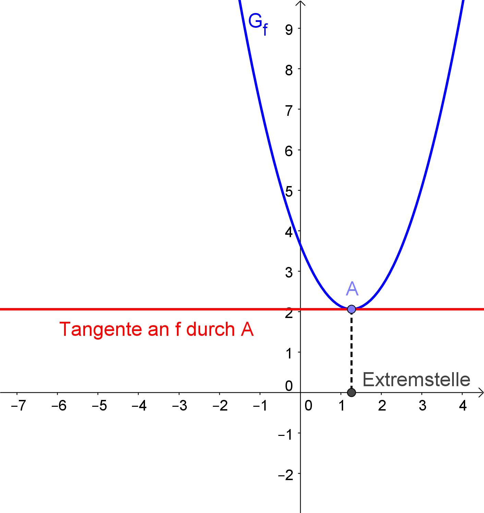

= Extremstellen
:stem:

== Motivation

Viele Aufgabenstellungen sind mit der Suche nach Hoch- und Tiefpunkten verbunden. Graphisch fällt es ziemlich leicht, die gesuchten Punkte zu finden. 

Dank der Ableitungen von Funktionen ist es auch möglich, die gesuchten Stellen zu finden, ohne den Graphen zeichnen zu müssen, verbunden mit der Tatsache, dass die gefundenen Werte exakter sind, da die Stellen nicht abgeschätzt werden, sondern berechnet werden können.

Im folgenden betrachten wir zwei Möglichkeiten, Extremstellen zu finden, wobei die untersuchten Funktionen mehrfach *differenzierbar* sein sollen (also ableitbar und damit "ohne Knick") und jede Funktion und ihre Ableitungen *stetig*, also "in einem Zug zeichenbar".

== Erste hinreichende Bedingung

.Funktion und ihre Ableitung

Das Besondere an Hoch- und Tiefpunkten <<Tangente>> ist _zum einen_, dass dort waagrechte Tangenten vorliegen.